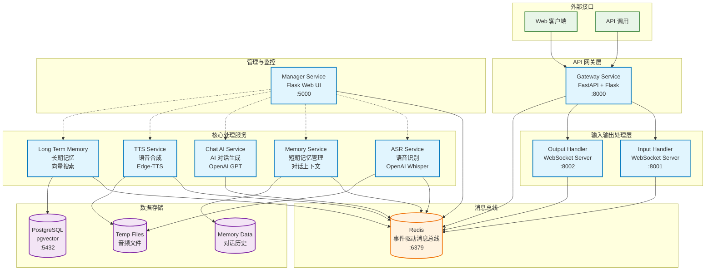
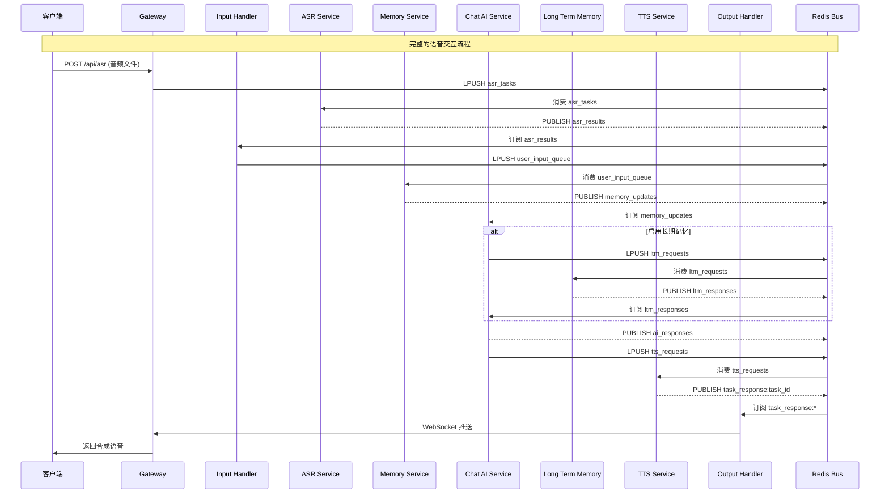
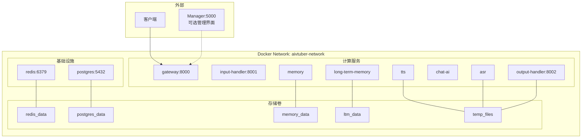

# Free-Agent-Vtuber 后端架构图

## 整体架构概览

## 消息流架构详图

## 核心服务详细说明

### 1. Gateway Service (网关服务)
- **技术栈**: FastAPI + Flask Blueprint
- **端口**: 8000
- **职责**:
  - 提供统一的API入口
  - 处理HTTP请求和WebSocket连接
  - 路由ASR请求到消息队列
  - 管理客户端连接状态

### 2. Input Handler (输入处理服务)
- **技术栈**: Python + WebSocket
- **端口**: 8001
- **职责**:
  - 订阅ASR识别结果
  - 标准化用户输入格式
  - 将处理后的输入推送到用户输入队列

### 3. ASR Service (语音识别服务)
- **技术栈**: Python + OpenAI Whisper
- **职责**:
  - 消费语音识别任务队列
  - 将音频文件转换为文本
  - 发布识别结果到消息总线

### 4. Memory Service (记忆管理服务)
- **技术栈**: Python
- **职责**:
  - 管理对话上下文和短期记忆
  - 维护用户会话状态
  - 为AI服务提供对话历史

### 5. Chat AI Service (AI对话服务)
- **技术栈**: Python + OpenAI GPT
- **职责**:
  - 生成AI回复
  - 整合长期记忆内容（如果启用）
  - 触发语音合成请求

### 6. Long Term Memory Service (长期记忆服务)
- **技术栈**: Python + pgvector + mem0
- **职责**:
  - 存储和检索长期记忆
  - 向量相似度搜索
  - 为对话提供相关历史信息

### 7. TTS Service (语音合成服务)
- **技术栈**: Python + Edge-TTS
- **职责**:
  - 将文本转换为语音
  - 生成音频文件
  - 发布合成结果

### 8. Output Handler (输出处理服务)
- **技术栈**: Python + WebSocket
- **端口**: 8002
- **职责**:
  - 处理服务输出
  - 通过WebSocket推送结果到客户端

## 数据存储架构

### Redis 消息总线
- **队列 (List)**:
  - `asr_tasks`: ASR识别任务
  - `user_input_queue`: 用户输入队列
  - `tts_requests`: TTS合成请求
  - `ltm_requests`: 长期记忆查询请求

- **发布/订阅 (Pub/Sub)**:
  - `asr_results`: ASR识别结果
  - `memory_updates`: 记忆更新通知
  - `ai_responses`: AI回复
  - `ltm_responses`: 长期记忆查询结果
  - `task_response:{task_id}`: 任务响应

### PostgreSQL + pgvector
- 存储长期记忆向量数据
- 支持语义相似度搜索
- 维护用户历史对话记录

### 文件存储
- 临时音频文件存储 (`/tmp/aivtuber_tasks`)
- 内存数据持久化 (`memory_data`)
- 长期记忆数据 (`ltm_data`)

## 架构特点

1. **事件驱动**: 基于Redis的消息总线实现松耦合
2. **微服务**: 每个功能模块独立部署和扩展
3. **异步处理**: 支持并发处理多个用户请求
4. **可插拔**: 支持不同的AI、TTS、ASR提供商
5. **容器化**: 所有服务均支持Docker部署
6. **可观测**: 完整的日志和监控体系

## 部署架构

这个架构设计实现了高度模块化、可扩展的AI虚拟主播系统，通过事件驱动的方式确保了系统的松耦合和高可用性。