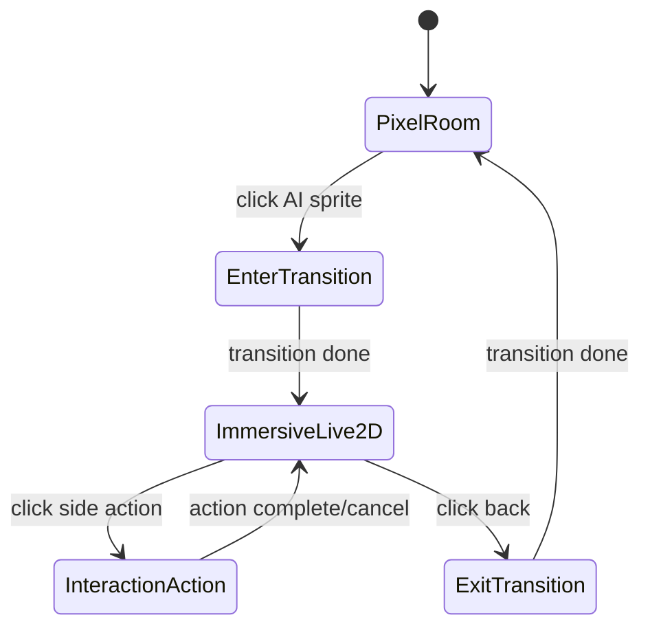

# 像素房间 -> 高清 Live2D 深度互动设计草案

日期：2026-03-21  
状态：Draft v1

## 1. 目标与设计原则

### 1.1 目标

1. 保留当前像素房间作为主界面的“低打扰陪伴层”。
2. 新增点击像素角色进入高清互动空间的“深度互动层”。
3. 在深度互动层提供养成式交互入口（按钮列），但首版控制范围，避免系统复杂度失控。
4. 明确保持桌宠（Pet Mode）现状，当前阶段不做大改。

### 1.2 设计原则

1. 双层体验明确分工：像素层看状态，高清层做互动。
2. 切换要平滑且可预期：从像素角色位置自然过渡到对应高清背景。
3. 状态统一：同一角色在两层中的情绪/动作/活动状态应来自同一状态源。
4. 渐进交付：先交付 MVP 闭环，再扩展养成系统。

## 2. 目标体验（用户视角）

1. 用户打开应用，默认看到 Pixel Room 主界面。
2. 用户点击像素角色（主 AI）。
3. 界面触发转场动画，进入高清房间 + Live2D 角色界面。
4. 右侧出现互动按钮列，用户可选择对话、互动动作、喂食、小游戏等行为。
5. 用户可随时点击“返回像素房间”，回到主界面，继续轻量陪伴式使用。

## 3. 交互流与状态机



## 4. 场景映射规则（像素位置 -> 高清背景）

### 4.1 核心规则

1. 角色在 Pixel Room 的“区域（area/slot）”决定进入高清模式时的背景。
2. 一套可配置映射表完成区域到高清背景的映射。
3. 映射缺失时回退到默认高清背景，避免空场景。

### 4.2 建议配置结构（概念）

```json
{
  "defaultBackgroundId": "studio-default",
  "areaToImmersiveBackground": {
    "desk": "studio-workbench",
    "coffee": "studio-cafe",
    "sofa": "studio-relax",
    "serverroom": "studio-tech"
  }
}
```

### 4.3 说明

1. 映射表建议先放在前端配置层，后续再开放到用户设置。
2. 高清背景应支持静态图或轻量动态层（先静态，后扩展）。
3. 若未来接入多角色，可在映射中增加 `characterId + area` 组合键策略。

## 5. Live2D 深度互动界面（右侧按钮列）

### 5.1 MVP 按钮建议（首版）

1. 对话：进入标准文本/语音对话（复用现有对话链路）。
2. 互动动作：触发角色动作/表情（拍头、打招呼、鼓励等）。
3. 喂食：消耗或赠送道具，反馈好感/心情变化（可先做无经济系统的演示版）。
4. 返回房间：退出高清模式回到 Pixel Room。

### 5.2 二期预留按钮位

1. 小游戏。
2. 装扮/换装。
3. 亲密剧情/记忆碎片。
4. 成长记录（亲密度、今日互动摘要）。

说明：`房间布置` 应归属 Pixel Room 的场景编辑能力，不放在高清深度互动按钮列中。

### 5.3 交互反馈建议

1. 所有按钮行为都应有即时视觉反馈（按钮态 + Live2D 动作/气泡）。
2. 长任务按钮要有进度或冷却提示，避免“点击无反应”。
3. 不可用行为给出具体原因（未解锁、道具不足、冷却中）。

## 6. 与当前代码结构的落地建议

### 6.1 前端结构建议（基于现有模块）

1. 在 `front_end/src/shells/MainShell.jsx` 增加“沉浸互动模式”入口状态。
2. 在 `front_end/src/components/office/OfficeScene.jsx` 为主角色增加 `onAgentClick` 事件出口。
3. 在 `front_end/src/App.jsx` 或 shell 层统一维护 `viewMode`：
   - `pixel-room`
   - `immersive-live2d`
4. 新增 `ImmersiveLive2DShell`（建议路径：`front_end/src/shells/ImmersiveLive2DShell.jsx`）承载：
   - 高清背景渲染层
   - Live2D 角色层
   - 右侧按钮列

### 6.2 状态建模建议

1. 新增 UI 级状态：
   - `immersiveContext.backgroundId`
   - `immersiveContext.sourceAreaId`
   - `immersiveContext.characterId`
2. 场景映射配置建议挂在 `officeSceneConfig` 同层，便于维护。
3. 保持聊天/语音 runtime 不变，仅在 UI 层扩充模式切换与动作触发。

### 6.3 Pet Mode 约束

1. 当前阶段不改 `PetShell` 主流程。
2. 如需统一状态，仅做只读同步，不引入沉浸模式入口。

## 7. 分阶段交付建议

### Phase 1（可上线 MVP）

1. 点击像素角色进入高清 Live2D 页面。
2. 区域到背景的映射与默认回退。
3. 右侧按钮列首版 4 个按钮（对话、互动动作、喂食、返回）。
4. 200-400ms 过渡动画。
5. 核心埋点（进入、退出、按钮点击、失败原因）。

### Phase 2（养成增强）

1. 喂食与好感度规则完善。
2. 小游戏与奖励回流。
3. 背景/主题设置页开放给用户。
4. 与多 Agent 扩展策略对齐（非主角色互动入口）。

## 8. 风险与对策

1. 风险：模式切换割裂。  
   对策：统一状态源，切换时保留最近活动态与角色情绪参数。
2. 风险：首版功能过重。  
   对策：MVP 仅做 4 按钮，小游戏和复杂养成放到二期。
3. 风险：低端设备性能下降。  
   对策：高清背景首版用静态资源，限制实时特效层数量。
4. 风险：交互不可见导致“像坏了”。  
   对策：所有按钮行为提供即时反馈与失败提示文案。

## 9. 验收标准（MVP）

1. 用户可从 Pixel Room 点击主 AI 进入高清 Live2D 模式，成功率 99%+（非网络依赖场景）。
2. 进入后背景与点击前区域映射一致；无映射时回退默认背景。
3. 右侧 4 个按钮可见、可点击、可反馈；不可用时给出原因。
4. 用户可稳定返回 Pixel Room，且主流程对话功能不回归。
5. 保持 Pet Mode 现有行为不受影响。

## 10. 本草案的边界

1. 本文为交互与架构草案，不包含最终视觉稿。
2. 本文不定义完整经济系统与数值系统，仅定义入口与可扩展位。
3. 本文不要求当前阶段改动主进程核心对话/语音 Runtime。
