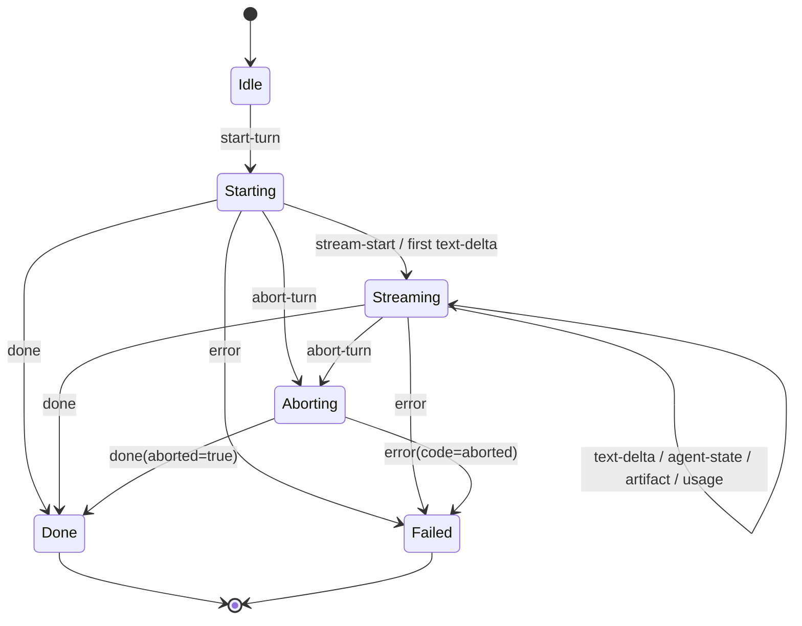

# Reasoning Backend Event Protocol v1（草案）

日期：2026-03-23  
状态：Draft

## 1. 目标与范围

本协议用于统一 `Conversation Runtime <-> 推理后端适配器` 的通信规则，支持：

1. 多后端并存（`nanobot`、未来 `nanoclaw` 等）。
2. 双层架构（快速反应层 + 推理后端）下的稳定事件语义。
3. 在不改 Renderer 消费逻辑的前提下替换/新增推理后端。

本协议是“后端接入协议”，不是 UI 展示协议。

## 2. 设计原则

1. 传输无关：可跑在 JSON Lines、IPC、WebSocket，上层语义一致。
2. 明确终态：一次 turn 必须以 `done` 或 `error` 之一结束。
3. 可重放与去重：事件需有单调递增 `seq`。
4. 后端无关：`nanobot`/`nanoclaw` 仅做能力映射，不向上暴露私有事件名。
5. 双层解耦：快速层负责“先回应/角色体验”，推理后端负责“能力执行与结果”。

## 3. 协议对象

### 3.1 命令（Runtime -> Backend）

`start-turn`

```json
{
  "protocolVersion": "rbep.v1",
  "type": "start-turn",
  "requestId": "req_xxx",
  "turnId": "turn_xxx",
  "sessionId": "default",
  "routeKey": "main:nanobot:default",
  "backend": "nanobot",
  "content": "用户输入文本",
  "attachments": [],
  "options": {
    "reasoningEffort": "",
    "timeoutMs": 120000
  },
  "metadata": {
    "inputSource": "text-composer",
    "personaPrelude": ""
  }
}
```

`abort-turn`

```json
{
  "protocolVersion": "rbep.v1",
  "type": "abort-turn",
  "requestId": "req_xxx",
  "turnId": "turn_xxx",
  "reason": "latest_wins"
}
```

### 3.2 事件（Backend -> Runtime）

公共 envelope（所有事件必带）：

```json
{
  "protocolVersion": "rbep.v1",
  "eventType": "text-delta",
  "requestId": "req_xxx",
  "turnId": "turn_xxx",
  "sessionId": "default",
  "backend": "nanobot",
  "seq": 3,
  "timestamp": "2026-03-23T10:11:12.000Z",
  "payload": {}
}
```

事件类型定义：

1. `stream-start`
   - payload: `{ "accepted": true }`
   - 表示后端已接单并开始处理。
2. `text-delta`
   - payload:
   - `content: string`（必填）
   - `phase: "progress" | "final"`（必填）
   - `final: boolean`（可选，建议 final 文本时为 true）
3. `agent-state`
   - payload:
   - `businessState: "idle" | "researching" | "executing" | "writing" | "syncing" | "error"`
   - `toolName: string`（可选）
   - `detail: string`（可选）
4. `artifact`
   - payload: `{ "kind": "image|file|json|...", "data": {}, "displayName": "" }`
5. `usage`
   - payload: `{ "inputTokens": 0, "outputTokens": 0, "latencyMs": 0 }`
6. `done`（终态）
   - payload:
   - `aborted: boolean`（可选）
   - `finishReason: "completed" | "aborted" | "max_tokens" | "stop" | "other"`（可选）
7. `error`（终态）
   - payload:
   - `code: string`（必填）
   - `message: string`（必填）
   - `status: number`（可选）
   - `retryable: boolean`（可选）

## 4. 关键约束（Normative）

1. 同一 `turnId` 的 `seq` 必须从 1 开始严格递增。
2. `done` 与 `error` 必须二选一，且最多出现一次。
3. `text-delta` 的 `content` 不能为空字符串。
4. 如果上游后端天然没有 `stream-start`，适配器可在第一条有效事件前合成。
5. 收到 `abort-turn` 后，后端应尽快发送 `done{aborted:true}` 或 `error{code:"aborted"}`。
6. 任意事件不得泄露敏感配置（如 API key）。

## 5. 状态机（Turn Lifecycle）



## 6. 双层架构下的责任边界

### 6.1 快速反应层（Fast Persona / Quick Layer）

负责：

1. 首句快速回应（synthetic fast path）。
2. 角色语气与短文本体验。
3. 决策是否升级到推理后端。

不负责：

1. 工具执行。
2. 推理后端专属中间态语义定义。

### 6.2 推理后端（Nanobot/Nanoclaw/…）

负责：

1. 能力执行与可靠终态回传。
2. 标准事件输出（RBEP v1）。
3. 可选的后端内部进度（映射为 `text-delta.phase=progress` 或 `agent-state`）。

不强制负责：

1. “先说一句安抚语”这类体验策略（应优先由快速层处理）。

## 7. 现有 Nanobot -> RBEP v1 映射表

| 现有 Nanobot 事件 | 当前字段 | RBEP v1 事件 | RBEP v1 payload |
|---|---|---|---|
| `progress` | `payload.content` | `text-delta` | `{ "content": "...", "phase": "progress", "final": false }` |
| `text-delta`（final） | `payload.content`, `payload.final` | `text-delta` | `{ "content": "...", "phase": "final", "final": true }` |
| `tool-hint` | `payload.content` | `agent-state` | `toolName/businessState/detail`（通过映射表推导） |
| `done` | `payload.aborted?` | `done` | `{ "aborted": false }` 或 `{ "aborted": true }` |
| `error` | `payload.code/message/status` | `error` | 原样映射到标准错误结构 |

工具态建议映射（沿用现有语义）：

1. `read_file/list_dir/web_search/web_fetch` -> `researching`
2. `write_file/edit_file/exec/spawn` -> `executing`

## 8. 与当前代码的迁移建议

### Phase 1（兼容接入）

1. 在 backend adapter 增加 RBEP v1 正规化层。
2. `nanobot_bridge.py` 先不大改，只做事件名映射与字段补全（`seq`、`phase`）。

### Phase 2（策略上移）

1. 将“文本清洗/去重增量/progress 展示策略”抽到共享 normalizer，避免仅 Nanobot 持有。
2. `nanobotBackend` 仅保留 Nanobot 专属兼容逻辑。

### Phase 3（后端扩展）

1. 新增 `nanoclawBackend` 时直接产出 RBEP v1 事件，不再复制 Nanobot 特化逻辑。
2. 为协议增加 conformance tests（终态唯一、seq 单调、abort 语义、错误映射）。

## 9. 低延迟措施是否要“全部去除”

不建议全部去除，建议分流：

1. 保留后端基础性能优化：
   - bridge 常驻/ready 握手、agent 缓存复用、并发与 abort 策略。
2. 上移通用体验优化：
   - 文本增量去重、工具痕迹清洗、进度展示规则。
3. 弱化后端“首句体验强约束”：
   - 快速层已承担首句职责后，推理后端 prompt 中的“先说一句”改为可配置兜底。

---

如果本草案通过，下一步建议产出：

1. `docs/reasoning-backend-event-protocol-v1.schema.json`（JSON Schema）
2. `desktop/electron/tests/reasoningBackendProtocol.test.js`（协议一致性测试）
3. `Nanobot adapter` 的 v1 规范化实现（最小改造）
