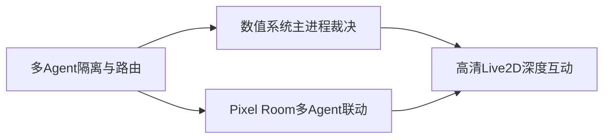

# 多 Agent 像素空间与数值系统统一规划

日期：2026-03-21  
状态：Unified Plan v1

## 1. 文档目的

基于以下三份草案形成统一执行方案，并处理它们之间的依赖关系与潜在冲突：

1. `像素房间 -> 高清 Live2D 深度互动设计草案`
2. `数值系统分层设计方案`
3. `多 Agent 隔离优先与像素空间打通方案`

目标是形成一个“可落地、可分期、可回归”的总路线：

1. 后端先完成多 Agent 隔离与多引擎并存主干。
2. Pixel Room 优先接入真实多 Agent 运行态。
3. 在统一状态源基础上扩展高清 Live2D 深度互动。
4. 用主进程数值系统承接互动反馈，保证长期可控与可审计。

## 2. 统一原则（合并后）

1. `隔离优先`：所有会话、事件、错误、状态更新都必须可唯一定位到 Agent。
2. `主进程单一真相源`：业务状态（包括数值）最终裁决与持久化在 Electron Main。
3. `体验分层`：Pixel Room 负责低打扰陪伴与多 Agent 总览；高清 Live2D 负责深度互动。
4. `协议先行`：先稳定事件契约，再扩展前端表现层，避免返工。
5. `渐进交付`：先打通主干闭环，再上养成与复杂互动。

## 3. 三份文档的关系图



关系说明：

1. 多 Agent 隔离是底座，不完成会导致 Pixel/Live2D/数值都无法稳定按 Agent 运作。
2. 数值系统是跨层能力，既服务聊天回合，也服务高清互动按钮（喂食、动作反馈）。
3. 高清 Live2D 是体验增强层，依赖前两者的稳定性，但可先做 UI 壳与映射能力。

## 4. 已识别冲突与统一决策

### 冲突 A：先做高清互动 MVP 还是先做多 Agent 隔离

1. 草案 1 倾向尽快上线高清互动 MVP。
2. 草案 3 明确“多 Agent 隔离为最高优先级”。

统一决策：

1. 以草案 3 为主顺序，先做隔离内核与事件契约。
2. 高清互动可并行做“UI 壳 + 过渡动画 + 背景映射”，但交互能力默认绑定主 Agent，避免抢占核心资源。

### 冲突 B：草案 1 倾向少改 runtime，草案 3 要改会话路由

1. 草案 1 提到“聊天/语音 runtime 尽量不变”。
2. 草案 3 要求并发控制升级到 `routeKey`。

统一决策：

1. runtime 做“兼容性扩展而非推翻重写”：
   - 新增 `agentId/backend/profileId` 入参。
   - 主进程内部构建 `routeKey`。
   - 未传 `agentId` 的旧调用默认到 `main`，保持兼容。
2. 对外 IPC 名称尽量不变，先扩字段，后灰度清理旧字段。

### 冲突 C：数值系统按角色存储 vs 多 Agent 隔离维度

1. 草案 2 数据模型以 `characterId` 为核心。
2. 草案 3 隔离核心键是 `agentId + backend + sessionNamespace`。

统一决策：

1. 数值主键采用双维：`agentId + characterId`。
2. 回合事件关联 `routeKey/turnId`，便于审计来源。
3. UI 展示以 Agent 为入口，角色为可选扩展（未来一个 Agent 多角色也可兼容）。

### 冲突 D：喂食/养成入口与数值风控节奏

1. 草案 1 想在首版就有“喂食”按钮。
2. 草案 2 强调先规则裁决、反刷和冷却。

统一决策：

1. 保留喂食按钮，但首版走“规则触发 + 主进程裁决”，不依赖模型自由发挥。
2. AI 建议型数值更新放在下一阶段引入，先做可控、可解释闭环。

## 5. 统一目标架构

### 5.1 后端与协议层

1. `AgentProfile`：按 Agent 管理后端选择、凭证引用、Live2D 配置。
2. `ConversationRuntime`：并发控制键升级为 `routeKey`。
3. `conversation:event` 统一携带：`agentId/backend/routeKey/sessionId/turnId/type/payload`。

### 5.2 状态与数值层（Main SoT）

1. `officeState`：持续作为 Pixel Room 多 Agent 展示总线。
2. `valueState`：主进程独立存储（mood/affinity 起步）。
3. `valueRuleEngine`：统一处理限幅、冷却、去重、回归、异常拦截。
4. `valueProposalService`：接收规则触发与 AI 建议，输出最终可落库增量。

### 5.3 前端体验层

1. `Pixel Room`：展示多 Agent 实时状态与焦点切换。
2. `ImmersiveLive2DShell`：承载高清背景、Live2D 与右侧互动列。
3. 场景映射：`area/slot -> immersive background`，支持默认回退。
4. 入口策略：先支持主 Agent 点击进入，后扩展到任一 Agent。

## 6. 统一数据与事件约定（建议）

### 6.1 路由字段（聊天事件必带）

```json
{
  "agentId": "main",
  "backend": "nanobot",
  "routeKey": "main:nanobot:default",
  "sessionId": "session_001",
  "turnId": "turn_001",
  "type": "text-delta",
  "payload": {}
}
```

### 6.2 数值日志字段（审计最小集）

```json
{
  "id": "evt_001",
  "agentId": "main",
  "characterId": "hiyori-main",
  "routeKey": "main:nanobot:default",
  "source": "rule|fast-model|reasoning-backend",
  "proposal": {},
  "applied": {},
  "createdAt": "2026-03-21T12:00:01.000Z"
}
```

## 7. 统一分阶段路线图

### Phase 0：契约预埋与兼容准备（1 周）

1. IPC 入参允许 `agentId/backend/profileId`（可选）。
2. 事件 envelope 预留并透传 `agentId/backend/routeKey`。
3. 旧前端默认仍按 `main` Agent 工作。

交付标准：旧功能零回归，新增字段可观测。

### Phase 1：多 Agent 隔离内核（1-2 周）

1. 并发控制从 `sessionId` 升级为 `routeKey`。
2. backend manager 支持按 Agent Profile 路由。
3. 错误映射与日志补齐 `agentId/backend/routeKey`。

交付标准：双 Agent 并发互不取消、互不串流。

### Phase 2：Pixel Room 打通 + 数值系统基础（1-2 周）

1. 聊天运行态按 `agentId` 回写 `officeState.agents[]`。
2. 新建 `valueStateStore + valueRuleEngine + valueState IPC`。
3. 先接入规则触发数值更新（不引入 AI 建议）。

交付标准：Pixel 可见多 Agent 实时状态；数值可持久化并可回放最近日志。

### Phase 3：高清 Live2D MVP（1-2 周）

1. 点击像素角色进入沉浸层（含 200-400ms 过渡）。
2. 完成 area 到高清背景映射与默认回退。
3. 上线 4 按钮：对话、互动动作、喂食、返回。
4. 喂食按钮接入规则引擎（限频、冷却、失败原因）。

交付标准：主流程稳定，Pet Mode 不受影响。

### Phase 4：AI 建议型数值与多引擎协同（1-2 周）

1. 接入结构化 `stat_updates` 协议。
2. 实现快速层与推理层建议合并（仍由主进程裁决）。
3. 完成低置信度拦截、冲突合并和灰度参数调优。

交付标准：数值变化可解释、可审计、可回滚策略。

### Phase 5：扩展能力（持续）

1. 扩展 stat（信任、压力、活力等）。
2. 开放背景/互动配置化与开发者调参面板。
3. 评估桌宠多实例（复用既有 routeKey 协议）。

## 8. 仓库落地建议（模块级）

建议以最小侵入方式新增/改造：

1. `desktop/electron/services/chat/conversationRuntime.js`
2. `desktop/electron/services/chat/backendManager.js`
3. `desktop/electron/ipc/conversation.js`
4. `desktop/electron/services/valueState/valueStateStore.js`
5. `desktop/electron/services/valueState/valueRuleEngine.js`
6. `desktop/electron/services/valueState/valueProposalService.js`
7. `desktop/electron/ipc/valueState.js`
8. `desktop/electron/preload.js`（`valueState` 只读桥接）
9. `front_end/src/services/desktopBridge.js`
10. `front_end/src/components/office/OfficeScene.jsx`
11. `front_end/src/shells/MainShell.jsx`
12. `front_end/src/shells/ImmersiveLive2DShell.jsx`（新增）

## 9. 统一验收清单

1. 多 Agent 并发聊天，彼此不抢占、不断流。
2. 多引擎并存时，事件与错误可准确归属到 `agentId/backend/routeKey`。
3. Pixel Room 正确展示多个 Agent 的状态变化。
4. 高清 Live2D 可从像素角色进入并稳定返回。
5. 喂食/动作触发有即时反馈，失败原因可见。
6. 数值更新可追溯（proposal/applied/ruleNotes）并支持重启恢复。
7. Pet Mode 行为不受回归影响。

## 10. 风险与缓解

1. 风险：前端仍有单流消费逻辑。  
   缓解：兼容期保留默认 `main` 路由，增加灰度开关与双写日志。
2. 风险：多引擎后错误类型膨胀。  
   缓解：统一错误 schema，强制包含路由字段。
3. 风险：互动入口放大刷分问题。  
   缓解：喂食/动作首版全部走规则引擎冷却与递减策略。
4. 风险：性能压力影响低端设备。  
   缓解：高清层首版静态背景优先，限制特效层与并发动画。

## 11. 最终结论

统一后的执行顺序是：

1. 先做“多 Agent 隔离 + 多引擎路由 + 协议统一”。
2. 再做“Pixel Room 多 Agent 联动 + 数值系统主进程底座”。
3. 然后上线“高清 Live2D MVP 深度互动”。
4. 最后接入“AI 建议型数值”和更复杂养成扩展。

这样可以同时满足三份文档的核心诉求，并将冲突收敛为“先底座、后体验、再智能增强”的单一路线。
