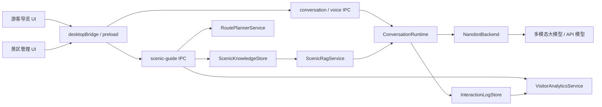

# 景区导览服务 AI 数字人赛题适配改造方案

日期：2026-05-04  
状态：Draft v1  
目标赛题：第十五届中国软件杯 A5「景区导览服务 AI 数字人」

## 1. 文档目的

本方案用于把当前 `OtakuClaw` 桌面 AI 伴随应用，调整为更符合「景区导览服务 AI 数字人」赛题要求的参赛作品原型。

当前项目已经具备可安装桌面端、数字人展示、语音输入输出、Nanobot 大模型后端、模型下载与本地运行时管理等基础能力。赛题要求的核心差距不在“有没有 AI 对话”，而在以下几类垂直业务能力：

1. 景区知识库与准确问答。
2. 游客兴趣画像与个性化路线推荐。
3. 数字人导览的场景化表达，包括口型、表情、语音、导游话术。
4. 管理端知识维护、形象配置、游客反馈分析与运营大屏。
5. 面向比赛评测的可验证指标，包括问答准确率、交互延迟、自然度与稳定性。

本文档只描述改造方向和落地计划，后续代码修改应按本文拆分阶段执行。

## 2. 赛题要求拆解

根据赛题截图，A5 赛题的关键要求可归纳为：

### 2.1 建设目标

1. 开发一个具备多模态交互能力的 AI 数字人导游软件。
2. 支持语音、文本、表情等多种交互方式。
3. 为游客提供实时智能问答、个性化路线讲解、情感互动。
4. 为景区管理方提供游客反馈分析。

### 2.2 游客端基本功能

1. 多模态交互：支持语音输入和文本输入，数字人以语音、表情和口型同步方式回答。
2. 智能问答与讲解：能回答景区历史、文化、景点特色等常见问题。
3. 个性化推荐：能根据游客兴趣，例如历史文化、自然风光，推荐不同游览路线和讲解重点。

### 2.3 管理后台基本功能

1. 知识库管理：上传、更新、维护景区讲解词、文史资料、常见问题及答案。
2. 数字人形象管理：配置数字人的外观、服装、声音等，使其更贴合景区文化特色。
3. 游客感受度报告：分析游客交互记录，生成关注点、情绪趋势、服务建议。
4. 数据大屏概览：展示当日或本周服务人次、热门问答、游客满意度趋势等运营数据。

### 2.4 非功能要求

1. 至少明确使用一个多模态大模型作为核心 AI 能力支撑。
2. 构建本地景区知识库，保证数字人回答准确性和自然度。
3. 景区相关问题准确率应达到可评测标准，截图中提到不低于 90%。
4. 语音问答延迟应控制在合理范围内，截图中示例为低于 5 秒。
5. 口型同步与语音自然度需要能通过演示视频或现场演示被感知。
6. 系统需要稳定，能够支持连续多轮交互和后台数据统计。

## 3. 当前项目与赛题的匹配度

| 赛题能力 | 当前项目状态 | 适配判断 |
| --- | --- | --- |
| 桌面端可安装应用 | Electron + Windows/macOS 打包已具备 | 可直接复用 |
| 文本对话 | `conversationRuntime` + Nanobot/OpenClaw 后端已具备 | 可复用，需改导游人格与知识约束 |
| 语音输入 | ASR 模型库、语音会话、VAD、IPC 已具备 | 可复用，需接入导览模式 |
| 语音输出 | TTS worker、流控、字幕同步已具备 | 可复用，需强化导游话术与音色选择 |
| 数字人形象 | Live2D、自定义模型导入、像素房间已具备 | 可复用，需做景区导游形象配置 |
| 表情/状态反馈 | Live2D 控制和 Pixel Room 状态已有基础 | 部分具备，需绑定问答/情绪/导览状态 |
| 景区知识库 | 暂无垂直知识库和管理界面 | 需要新增 |
| RAG 准确问答 | Nanobot 可接外部上下文，但无景区专用检索链路 | 需要新增 |
| 路线推荐 | 暂无路线、点位、游客偏好模型 | 需要新增 |
| 管理后台 | 现有设置面板偏运行时配置，不是景区运营后台 | 需要新增 |
| 游客反馈分析 | 仅有对话/状态事件，暂无运营分析聚合 | 需要新增 |
| 数据大屏 | 暂无 | 需要新增 |
| 比赛演示数据 | 暂无标准景区数据包和测试题集 | 需要新增 |

结论：当前项目适合作为“数字人交互底座”，但需要新增一层「景区导览业务域」。改造重点应放在 `Scenic Guide` 领域模块，而不是重写已有语音、桌面端和模型运行时。

## 4. 产品定位调整

建议将参赛版本定位为：

> 一个可部署在景区服务台、游客中心、展馆终端或桌面讲解设备上的 AI 数字人导游系统，支持游客通过语音或文字咨询景点信息，获得个性化路线推荐，并让景区管理者维护知识库、配置数字人形象、查看游客反馈和运营数据。

### 4.1 应用模式

保留现有桌面能力，但新增两类面向比赛的主入口：

1. 游客导览模式  
   面向游客，突出数字人、语音问答、景点讲解、路线推荐。

2. 景区管理模式  
   面向工作人员，提供知识库、路线、数字人形象、反馈分析和数据大屏。

### 4.2 演示命名建议

代码仓库可继续叫 `OtakuClaw`，但参赛演示中的产品名建议改为更贴近赛题，例如：

1. `灵境导游 AI`
2. `星旅导览数字人`
3. `OpenClaw Scenic Guide`

首版可先在 UI 层新增“景区导览模式”，不急于全局改包名和构建产物名，避免影响已有打包链路。

## 5. 总体架构改造

### 5.1 分层原则

1. 复用已有 `Electron Main` 作为安全可信业务层，景区知识库、游客日志、统计聚合都放在主进程侧。
2. 复用已有 `conversation:event` 事件流和语音链路，不重新发明聊天协议。
3. 新增 `scenicGuide` 业务域服务，负责景点资料、路线推荐、RAG 检索、反馈分析。
4. 前端新增游客端和管理端 UI，但继续走 `preload` 暴露的最小 IPC API。
5. 所有景区资料、游客日志、评价统计默认本地存储，便于比赛离线演示和隐私说明。

### 5.2 推荐目标架构



### 5.3 新增主进程模块建议

建议新增目录：

`desktop/electron/services/scenicGuide/`

包含：

1. `scenicKnowledgeStore.js`  
   负责景点、FAQ、讲解词、文史资料、服务设施等结构化资料的读写。

2. `scenicRagService.js`  
   负责本地知识检索、候选片段排序、答案上下文组装、引用来源返回。

3. `routePlannerService.js`  
   根据游客兴趣、游览时长、人群类型和景点标签生成路线。

4. `visitorProfileService.js`  
   从会话中维护游客偏好，例如历史文化、亲子、自然风光、轻松路线。

5. `interactionLogStore.js`  
   记录游客问题、命中知识、回答状态、满意度、情绪标签和延迟指标。

6. `visitorAnalyticsService.js`  
   聚合服务人次、热门问题、满意度趋势、情绪趋势和服务建议。

7. `scenicGuidePrompt.js`  
   定义导游人格、回答边界、知识引用、推荐话术和安全兜底。

建议新增 IPC：

`desktop/electron/ipc/scenicGuide.js`

暴露：

1. `scenic-guide:get-config`
2. `scenic-guide:save-config`
3. `scenic-guide:list-spots`
4. `scenic-guide:save-spot`
5. `scenic-guide:import-knowledge`
6. `scenic-guide:search-knowledge`
7. `scenic-guide:plan-route`
8. `scenic-guide:get-analytics`
9. `scenic-guide:list-interactions`
10. `scenic-guide:rate-answer`

### 5.4 新增前端模块建议

建议新增：

1. `front_end/src/shells/ScenicGuideShell.jsx`  
   游客端主界面：数字人、语音按钮、文本输入、推荐问题、路线卡片。

2. `front_end/src/shells/ScenicAdminShell.jsx`  
   管理端主界面：知识库、路线配置、数字人配置、反馈分析、大屏。

3. `front_end/src/components/scenic/GuideStage.jsx`  
   数字人展示区，复用 Live2DViewer 和字幕/TTS 状态。

4. `front_end/src/components/scenic/RoutePlannerPanel.jsx`  
   兴趣选择、游览时长、人群类型、路线结果。

5. `front_end/src/components/scenic/KnowledgeManager.jsx`  
   景区知识增删改查、导入、检索测试。

6. `front_end/src/components/scenic/GuidePersonaManager.jsx`  
   导游形象、服装、音色、口吻配置。

7. `front_end/src/components/scenic/AnalyticsDashboard.jsx`  
   热门问题、服务次数、满意度、情绪趋势、建议。

8. `front_end/src/components/scenic/ScenicBigScreen.jsx`  
   比赛演示用大屏，可一键展示核心运营指标。

## 6. 核心功能改造方案

### 6.1 景区知识库与准确问答

这是最影响赛题评分的模块，优先级最高。

#### 6.1.1 数据范围

知识库至少应覆盖：

1. 景区概况：名称、等级、开放时间、地址、票务、交通。
2. 景点点位：每个点位的历史、文化、特色、最佳观赏时间、注意事项。
3. 讲解词：适合数字人口播的短讲解、中讲解、长讲解。
4. FAQ：门票、停车、厕所、无障碍、餐饮、寄存、亲子服务、雨天方案。
5. 路线素材：路线名称、点位顺序、预计耗时、适合人群、推荐理由。
6. 应急服务：医务点、游客中心、失物招领、投诉建议。

#### 6.1.2 推荐数据格式

首版使用本地 JSON 文件即可，便于比赛演示和离线运行：

```json
{
  "scenicId": "demo-scenic",
  "name": "示例景区",
  "spots": [
    {
      "id": "gate",
      "name": "游客中心",
      "tags": ["服务", "起点"],
      "summary": "游客入园咨询、寄存和路线规划的主要服务点。",
      "stories": [],
      "faq": []
    }
  ],
  "routes": [
    {
      "id": "history-half-day",
      "name": "历史文化半日线",
      "durationMinutes": 180,
      "interestTags": ["历史文化"],
      "spotIds": ["gate"],
      "reason": "适合希望了解景区历史背景的游客。"
    }
  ]
}
```

#### 6.1.3 RAG 策略

首版不建议直接让大模型自由回答景区知识，而应采用“检索增强 + 受控回答”：

1. 用户问题进入 `scenicRagService`。
2. 本地按景点名、同义词、标签、FAQ 问法和正文关键词检索候选片段。
3. 将排名靠前的片段注入 Nanobot 上下文。
4. Prompt 要求数字人优先依据知识库回答。
5. 如果知识库没有命中，回答“这个信息我还没有收录，可以帮你联系游客中心或换个问法”，避免幻觉。
6. 每次回答记录命中片段和置信度，用于后台准确率评估。

#### 6.1.4 准确率验收

新增 `docs/scenic-demo/eval/questions.json` 测试题集，至少 100 条：

1. 景点历史文化类 30 条。
2. 服务设施类 25 条。
3. 路线推荐类 20 条。
4. 开放时间、票务、交通类 15 条。
5. 边界问题和知识库未收录问题 10 条。

每条题应包含：

1. `question`
2. `expectedFacts`
3. `sourceDocIds`
4. `mustNotSay`
5. `category`

目标：景区知识相关问题事实命中率不低于 90%，未收录问题不编造。

### 6.2 个性化路线推荐

路线推荐不需要一开始就做复杂地图导航，首版可做“偏好问卷 + 知识库路线生成 + 数字人讲解”。

#### 6.2.1 游客偏好维度

游客端提供轻量选择：

1. 兴趣：历史文化、自然风光、亲子互动、拍照打卡、轻松休闲。
2. 时间：1 小时、2 小时、半日、一日。
3. 人群：个人、情侣、亲子、老人、研学团队。
4. 体力：轻松、适中、充实。
5. 需求：少排队、无障碍、雨天可行、餐饮优先。

#### 6.2.2 路线输出形态

数字人应输出：

1. 路线名称。
2. 点位顺序。
3. 预计耗时。
4. 推荐理由。
5. 每个点位一句讲解重点。
6. 可替换点位或雨天备选方案。

前端显示为路线卡片，不只是一段文字，方便评委看到“推荐功能已产品化”。

### 6.3 数字人导览体验

当前 Live2D 与语音链路是项目优势，应将其包装为“导游数字人”。

#### 6.3.1 导游人格

新增导游 Persona：

1. 语气：热情、自然、简洁，像景区讲解员。
2. 回答长度：默认 30-90 秒内可听完；游客追问时再展开。
3. 讲解结构：先给结论，再补背景，再给游览建议。
4. 边界：不能编造票价、开放状态、天气和实时拥堵。

#### 6.3.2 表情与动作映射

将现有状态扩展为导览语义：

| 事件 | 数字人表现 |
| --- | --- |
| 听游客说话 | 倾听、轻微点头 |
| 检索知识库 | 思考、查看资料 |
| 讲解历史文化 | 平稳微笑、讲解手势 |
| 推荐路线 | 指引、展示路线卡 |
| 遇到未知问题 | 抱歉、建议联系游客中心 |
| 收到好评 | 开心表情 |
| 收到差评 | 认真记录、安抚 |

#### 6.3.3 口型同步

复用现有 TTS 字幕和播放生命周期，首版目标：

1. TTS 播放时 Live2D 进入 speaking 状态。
2. 根据音频能量或 TTS chunk 节奏驱动简单口型开合。
3. 回答结束后恢复 idle。
4. 管理端可选择音色，游客端不暴露复杂配置。

### 6.4 管理后台

管理后台是当前项目缺口，需要新增可演示界面。

#### 6.4.1 知识库管理

首版支持：

1. 新增、编辑、删除景点资料。
2. 新增、编辑 FAQ。
3. 导入 JSON/Markdown 文档。
4. 检索测试：输入游客问题，显示命中文档和置信度。
5. 发布状态：草稿、已发布。

#### 6.4.2 数字人形象管理

复用现有 Live2D 模型导入能力，新增更贴近景区的配置层：

1. 当前导游模型。
2. 当前音色。
3. 讲解语气：亲切、专业、活泼。
4. 服装/主题：如果没有真实服装系统，首版可用模型、背景和欢迎语配置表达。

注意：当前 `front_end/src/assets/office/star-office/` 资产只适合评估学习，不适合商业发布。参赛若涉及公开展示或后续落地，应准备自研或授权的景区主题资产。

#### 6.4.3 游客感受度报告

通过交互日志生成：

1. 热门关注点：被问最多的景点、服务和路线。
2. 情绪趋势：正向、中性、负向问题占比。
3. 未命中问题：知识库没有回答好的问题列表。
4. 服务建议：例如“厕所位置咨询较多，建议入口处增加提示牌”。
5. 满意度：游客点赞、点踩或星级评价趋势。

首版情绪分析可以先用规则和关键词，后续再接多模态情感模型。

#### 6.4.4 数据大屏

比赛演示建议做一个专门的大屏页，展示：

1. 今日服务人次。
2. 今日语音问答次数。
3. 热门问题 Top 10。
4. 热门景点 Top 5。
5. 路线推荐次数。
6. 满意度趋势。
7. 知识库命中率。
8. 平均响应延迟。

### 6.5 多模态模型说明

赛题要求明确使用至少一个多模态大模型。当前项目已有：

1. 文本大模型后端：Nanobot Provider，可接 OpenAI-compatible、DashScope 等。
2. 语音 ASR/TTS 模型：Sherpa、Qwen3 MLX、Edge TTS 等。
3. 截图提问链路：已有 `capture` 相关 IPC 和前端控制。

建议参赛版本在文档和 UI 中明确：

1. 核心大模型：使用 Nanobot 接入的多模态或通用大模型。
2. 语音理解：ASR 将游客语音转文本。
3. 语音生成：TTS 将导游回答转语音。
4. 视觉/多模态增强：可通过截图提问或上传景点图片，让数字人辅助识别和讲解。

如果比赛现场要求严格的“图像 + 文本”多模态能力，应新增游客端“拍照问导游”入口，复用现有截图捕获能力，将图片和问题交给多模态模型。

## 7. 文件级落地清单

### 7.1 主进程

建议新增：

1. `desktop/electron/services/scenicGuide/scenicKnowledgeStore.js`
2. `desktop/electron/services/scenicGuide/scenicRagService.js`
3. `desktop/electron/services/scenicGuide/routePlannerService.js`
4. `desktop/electron/services/scenicGuide/visitorProfileService.js`
5. `desktop/electron/services/scenicGuide/interactionLogStore.js`
6. `desktop/electron/services/scenicGuide/visitorAnalyticsService.js`
7. `desktop/electron/services/scenicGuide/scenicGuidePrompt.js`
8. `desktop/electron/ipc/scenicGuide.js`

建议修改：

1. `desktop/electron/main.js`：注册 scenic guide IPC。
2. `desktop/electron/preload.js`：暴露最小 `scenicGuide` API。
3. `desktop/electron/services/chat/conversationRuntime.js`：会话上下文允许携带 scenic profile、RAG 命中和游客画像。
4. `desktop/electron/services/chat/backends/nanobotBackend.js`：支持导游模式下的额外上下文和回答元信息。
5. `desktop/electron/services/voice/ttsService.js`：为导游音色选择预留 profile。

### 7.2 前端

建议新增：

1. `front_end/src/shells/ScenicGuideShell.jsx`
2. `front_end/src/shells/ScenicGuideShell.css`
3. `front_end/src/shells/ScenicAdminShell.jsx`
4. `front_end/src/shells/ScenicAdminShell.css`
5. `front_end/src/components/scenic/GuideStage.jsx`
6. `front_end/src/components/scenic/GuideChatPanel.jsx`
7. `front_end/src/components/scenic/RoutePlannerPanel.jsx`
8. `front_end/src/components/scenic/KnowledgeManager.jsx`
9. `front_end/src/components/scenic/GuidePersonaManager.jsx`
10. `front_end/src/components/scenic/AnalyticsDashboard.jsx`
11. `front_end/src/components/scenic/ScenicBigScreen.jsx`
12. `front_end/src/services/scenicGuideBridge.js`

建议修改：

1. `front_end/src/App.jsx`：增加游客导览模式和管理模式路由/入口。
2. `front_end/src/shells/MainShell.jsx`：加入模式切换入口。
3. `front_end/src/components/config/ConfigDrawer.jsx`：收敛底层模型配置，不让游客端看到复杂运行时设置。
4. `front_end/src/components/live2d/Live2DViewer.jsx`：接入导览语义状态和口型状态。
5. `front_end/src/services/desktopBridge.js`：封装 scenic guide IPC。

### 7.3 演示数据与评测

建议新增：

1. `docs/scenic-demo/README.md`
2. `docs/scenic-demo/demo-scenic.json`
3. `docs/scenic-demo/eval/questions.json`
4. `docs/scenic-demo/eval/scoring-guide.md`
5. `desktop/electron/tests/scenicKnowledgeStore.test.js`
6. `desktop/electron/tests/scenicRagService.test.js`
7. `desktop/electron/tests/routePlannerService.test.js`
8. `desktop/electron/tests/visitorAnalyticsService.test.js`
9. `front_end/tests/scenicGuideShell.test.jsx`
10. `front_end/tests/scenicAdminShell.test.jsx`

## 8. 分阶段实施计划

### Phase 0：赛题化文案与演示数据准备

目标：让项目从“桌宠 AI”转成“景区导览 AI 数字人”的产品叙事。

交付：

1. 新增本方案文档。
2. 准备一个 `demo-scenic.json` 示例景区数据包。
3. 准备 50-100 条景区问答评测题。
4. 梳理参赛演示脚本：游客问答、路线推荐、后台大屏。

验收：

1. 团队能依据文档拆任务。
2. 评测题能覆盖主要赛题要求。

### Phase 1：景区知识库与 RAG 闭环

目标：优先保证问答准确率。

交付：

1. `scenicKnowledgeStore`
2. `scenicRagService`
3. `scenic-guide:search-knowledge`
4. 导游模式 prompt
5. 游客问题命中知识片段后再进入 Nanobot 回答
6. 回答记录包含命中文档和置信度

验收：

1. 能从本地景区数据回答景点历史、服务设施、路线等问题。
2. 未命中问题不编造。
3. 评测题事实命中率达到阶段目标，例如 80%，后续迭代到 90%。

### Phase 2：游客导览模式 UI

目标：让评委一打开应用就看到“这是景区导览数字人”。

交付：

1. `ScenicGuideShell`
2. 数字人主舞台
3. 推荐问题入口
4. 语音/文本双输入
5. 路线推荐卡片
6. 答案来源和游客评价按钮

验收：

1. 游客可以完成语音提问、文本提问、路线推荐。
2. 数字人回答时有语音、字幕、表情状态。
3. UI 不暴露 Nanobot、模型路径、运行时安装等工程细节。

### Phase 3：管理后台 MVP

目标：覆盖赛题后台要求。

交付：

1. 知识库管理页。
2. 路线管理页。
3. 数字人形象/音色配置页。
4. 游客交互记录页。
5. 数据大屏页。

验收：

1. 管理员可以新增/修改 FAQ 并影响游客端问答。
2. 管理员可以看到热门问题、满意度、未命中问题。
3. 数据大屏可用于比赛演示。

### Phase 4：多模态增强与自然度优化

目标：强化“AI 数字人”观感，而不仅是聊天窗口。

交付：

1. 数字人 speaking/listening/thinking/guiding/error 状态映射。
2. 基于音频能量或 TTS chunk 的基础口型同步。
3. 拍照问导游或截图问导游入口。
4. 情绪识别与安抚话术。

验收：

1. 语音问答端到端延迟尽量低于 5 秒。
2. 数字人口播时有明显口型和表情反馈。
3. 游客负面反馈能进入后台感受度报告。

### Phase 5：比赛打磨与验收材料

目标：形成可提交、可演示、可答辩的参赛版本。

交付：

1. 演示视频脚本。
2. 技术架构图。
3. 功能清单。
4. 评测报告：准确率、响应延迟、稳定性。
5. 隐私与安全说明。
6. 第三方模型和素材许可说明。

验收：

1. 可在无开发环境的机器上安装演示。
2. 可连续完成 10-20 轮游客问答不崩溃。
3. 可展示游客端、管理端、大屏和知识库更新闭环。

## 9. 优先级建议

P0 必须做：

1. 景区知识库数据结构。
2. RAG 检索和受控回答。
3. 游客导览模式主界面。
4. 个性化路线推荐。
5. 管理后台知识库管理。
6. 交互日志与热门问题统计。

P1 强烈建议做：

1. 数据大屏。
2. 数字人导游 Persona。
3. 语音问答体验打磨。
4. 口型同步和表情状态。
5. 满意度评价和未命中问题列表。
6. 演示题集与准确率脚本。

P2 有余力再做：

1. 图片/截图问导游。
2. 更细的情绪识别。
3. 多景区切换。
4. 实时客流或天气 API。
5. 移动端 H5 适配。

## 10. 比赛演示主线建议

建议答辩演示按以下顺序：

1. 打开游客导览模式，数字人欢迎游客。
2. 游客语音问：“这里最值得看的历史景点是什么？”
3. 数字人用语音和字幕回答，并展示知识来源。
4. 游客选择“我喜欢历史文化，只有 2 小时”，系统生成路线卡片。
5. 游客追问某个景点的故事，数字人继续讲解。
6. 游客点踩一个回答或提出“讲得太长了”，系统记录反馈。
7. 切换管理后台，展示该问题进入交互日志和统计。
8. 管理员编辑一条 FAQ，返回游客端重新提问，展示知识库更新生效。
9. 打开数据大屏，展示服务人次、热门问题、满意度趋势、未命中问题。
10. 说明底层使用多模态大模型、ASR/TTS、Live2D 数字人和本地知识库。

## 11. 风险与处理策略

### 11.1 问答幻觉风险

风险：大模型自由发挥会编造景区历史、票价、开放时间。  
处理：所有景区事实类回答必须走 RAG；未命中时明确提示未知；后台记录未命中问题。

### 11.2 语音延迟风险

风险：ASR、LLM、TTS 串联后超过 5 秒。  
处理：复用现有 Nanobot progress 机制，先输出短反馈；RAG 检索本地化；TTS 使用流式输出；后台记录 TTFT 和完整响应耗时。

### 11.3 数字人自然度不足

风险：只有静态模型和字幕，看起来不像数字人导游。  
处理：优先实现 speaking/listening/thinking 状态、基础口型同步、导游手势或表情映射。

### 11.4 后台过于工程化

风险：现有 ConfigDrawer 偏模型配置，不符合景区管理人员使用习惯。  
处理：新增独立管理后台，把模型配置隐藏到高级设置，把知识库、路线和数据放在主流程。

### 11.5 素材许可风险

风险：现有部分像素办公室素材仅适合学习评估。  
处理：参赛展示优先使用自制、授权或可商用素材；文档中保留第三方许可说明。

## 12. 推荐的第一批代码任务

建议后续从以下任务开始，风险低、收益高：

1. 新增 `docs/scenic-demo/demo-scenic.json`，先做一套演示景区知识数据。
2. 新增 `scenicKnowledgeStore` 和单元测试。
3. 新增 `scenicRagService` 和 20 条问答评测。
4. 在 `preload` 暴露 `scenicGuide.searchKnowledge` 和 `scenicGuide.planRoute`。
5. 新增 `ScenicGuideShell`，把 Live2D、聊天、路线卡片整合成游客端。
6. 新增 `KnowledgeManager`，实现 FAQ 编辑后游客端立即生效。
7. 新增 `AnalyticsDashboard`，先统计本地交互日志。

这批完成后，项目就能从“有数字人能力”转为“符合景区导览赛题的端到端原型”。

