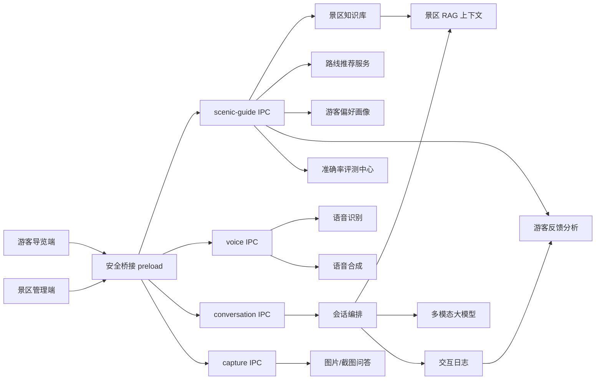

# 景区导览服务 AI 数字人高奖改造方案

日期：2026-05-04  
状态：Replacement v2  
目标赛题：第十五届中国软件杯 A5「景区导览服务 AI 数字人」

## 1. 评委视角结论

如果以比赛高奖标准审视当前项目，`OtakuClaw` 的优势是已经有桌面端、数字人显示、语音输入输出、流式对话、模型下载、截图提问和本地运行时管理；劣势是产品叙事仍偏“桌面 AI 伴随/开发助手”，和“景区导览服务 AI 数字人”的行业场景不够贴合。

高分改造不能只是新增几个景区页面，而要做一次明确的产品收敛：

1. 删除或隐藏会让评委觉得跑题的入口和概念，例如桌宠娱乐化入口、像素房间、办公室、多 Agent 工作空间、家具编辑、开发助手语义。
2. 把现有能力重组为“游客端 + 管理端 + 知识库 + 数据分析 + 多模态数字人”的行业解决方案。
3. 用真实景区数据、可测准确率、可测延迟、可演示后台闭环证明系统不是聊天壳。
4. 把所有复杂模型配置隐藏到高级设置，评委和游客看到的是“景区导游系统”，不是工程调试工具。

一句话：保留底层能力，重做上层产品。高奖版本要像景区能采购的数字人导览终端，而不是给现有桌宠项目套一层景区文案。

## 2. 赛题目标拆解

根据赛题截图，作品需要覆盖以下核心目标。

### 2.1 游客侧

1. 支持语音输入和文本输入。
2. 数字人能用语音、字幕、表情、口型同步回答。
3. 能准确回答景区历史、文化、景点特色、服务设施等问题。
4. 能根据游客兴趣、时间、人群、体力偏好推荐个性化路线。
5. 能进行自然讲解和情感互动。
6. 最好支持图片/截图提问，以体现多模态能力。

### 2.2 管理侧

1. 景区知识库管理：讲解词、文史资料、常见问题、服务信息。
2. 数字人形象管理：形象、服装/主题、声音、讲解风格。
3. 游客感受度报告：关注点、情绪趋势、差评原因、服务建议。
4. 数据大屏：服务人次、热门问题、满意度、知识命中率、平均延迟。

### 2.3 非功能侧

1. 至少明确使用一个多模态大模型作为核心 AI 支撑。
2. 本地景区知识库必须可维护、可检索、可追溯。
3. 景区事实问答准确率应以测试集证明，目标不低于 90%。
4. 语音问答延迟要可测，目标首句反馈低于 2 秒，完整回答低于 5 秒。
5. 系统能连续演示，不因模型下载、运行时配置或后台异常中断。
6. 素材和模型使用需要有许可说明，避免参赛合规风险。

## 3. 当前项目可复用能力

| 当前能力 | 对赛题价值 | 处理方式 |
| --- | --- | --- |
| Electron 桌面端和打包 | 可做景区服务台/游客中心终端 | 保留 |
| Live2D 模型显示与导入 | 可作为 AI 数字人形象底座 | 保留并改成导游形象 |
| ASR、VAD、TTS、字幕播放 | 可支撑语音问答和口播讲解 | 保留并调优 |
| Nanobot/大模型后端 | 可作为问答和推荐推理引擎 | 保留但隐藏工程名 |
| 流式对话与中间态反馈 | 有利于降低等待感 | 保留并接入导游话术 |
| 截图捕获 | 可扩展为拍照问导游/图片问答 | 保留并改造入口 |
| 安全配置和密钥存储 | 适合比赛演示与真实部署 | 保留 |
| 下载中心/模型运行时 | 适合安装部署 | 保留到管理员高级设置 |

## 4. 当前项目必须删除或隐藏的内容

以下内容不是没有技术价值，而是会削弱赛题聚焦度。高奖版本应从默认体验、演示脚本和答辩材料中删除或隐藏。

### 4.1 默认游客端删除

1. 像素房间入口。
2. 办公室、工位、家具编辑等场景。
3. 桌宠娱乐化拖拽玩法。
4. 多 Agent 工作空间概念。
5. 开发助手、文件操作、工具执行等暗示。
6. 与景区服务无关的二次元陪伴文案。
7. 面向开发者的模型下载细节、Python 环境细节、后端名称细节。

### 4.2 管理端隐藏到高级设置

1. Nanobot/OpenClaw 等工程后端名。
2. 模型路径、Python 运行时、依赖环境安装日志。
3. 高风险工具开关。
4. 通用聊天参数。
5. 与景区知识维护无关的调试控件。

### 4.3 发布包和演示材料移除

1. 非商业或用途不明确的展示素材。
2. 与赛题无关的历史规划文档截图。
3. 容易让评委误解为“桌宠项目改名”的 README 文案。
4. 入口页中的 Otaku、Claw、宠物、办公室等强绑定旧产品心智的表达。

保留这些能力的代码可以暂时不删，但必须从比赛默认路径中不可见。评委最先看到的 3 分钟决定印象，不应让他们花时间理解旧项目。

## 5. 高奖版产品形态

高奖版建议改造成双端结构：

1. 游客导览端：面向游客使用，强调数字人、语音问答、景点讲解、路线推荐、拍照提问。
2. 景区管理端：面向景区工作人员，强调知识维护、数字人配置、游客反馈、运营大屏、评测结果。

### 5.1 游客导览端首页

第一屏必须直接体现赛题：

1. 中央或左侧是景区导游数字人。
2. 右侧或底部是语音按钮、文本输入、推荐问题。
3. 有景区名称、当前导览主题、推荐路线入口。
4. 有“拍照问导游”或“识图讲解”入口。
5. 有“历史文化 / 自然风光 / 亲子游 / 无障碍 / 半日游”等快捷偏好。

不做营销落地页，不做项目介绍页，不让游客先配置模型。

### 5.2 景区管理端首页

管理端第一屏展示运营视角：

1. 今日服务人次。
2. 平均响应延迟。
3. 知识库命中率。
4. 满意度。
5. 热门问题。
6. 未命中问题。
7. 路线推荐次数。
8. 需要补充的知识条目。

这会让评委看到“服务闭环”，而不是单纯问答 Demo。

## 6. 总体改造架构

高奖版架构应从“通用对话应用”改成“景区导览业务系统”。



核心原则：

1. 游客端只关心问答、讲解、路线、反馈。
2. 管理端只关心知识、形象、运营、评测。
3. 主进程保存和裁决业务数据。
4. Renderer 不直接接触密钥、文件系统、Python 或模型执行。
5. 大模型回答景区事实问题前必须经过知识库检索。

## 7. 增删改查总清单

这里的“增删改查”不是普通 CRUD，而是面向高奖目标的整体工程归并。

### 7.1 必须新增

1. 景区知识库数据模型。
2. 本地知识检索和 RAG 注入服务。
3. 景区导游 Persona 和受控回答 Prompt。
4. 个性化路线推荐服务。
5. 游客偏好画像。
6. 交互日志和满意度评价。
7. 游客感受度分析。
8. 数据大屏。
9. 管理端知识库编辑器。
10. 管理端路线编辑器。
11. 管理端数字人形象和音色配置。
12. 图片/截图问导游入口。
13. 准确率评测题集和评分脚本。
14. 延迟、命中率、满意度等可量化指标采集。
15. 比赛演示景区数据包和演示脚本。

### 7.2 必须删除或隐藏

1. 默认游客端中的像素房间。
2. 默认游客端中的桌宠模式。
3. 默认游客端中的办公室和家具编辑。
4. 默认游客端中的多 Agent 叙事。
5. 默认游客端中的通用聊天产品文案。
6. 默认游客端中的底层模型配置入口。
7. 默认游客端中的文件执行、工具执行、开发助手暗示。
8. 发布演示中的非景区素材和非商业素材。
9. 答辩材料中的旧项目路线图。

### 7.3 必须修改

1. 产品名称和 UI 语言：从桌面 AI 伴随改为景区导览数字人。
2. `App.jsx` 主入口：从原有模式切换改为游客导览端/景区管理端。
3. `MainShell`：收敛为景区业务壳，旧入口放到开发者模式。
4. `ConfigDrawer`：改为管理员高级设置，不进入游客主路径。
5. `Live2DViewer`：增加导游语义状态，包含 listening、thinking、speaking、guiding、apologizing。
6. 语音链路：默认中文导游音色，TTS 中间态适配口播。
7. 对话链路：景区模式下先检索知识库，再调用大模型。
8. 后端命名：UI 中把 Nanobot/OpenClaw 抽象为“AI 引擎”。
9. 日志结构：每轮记录问题、命中知识、回答、延迟、评价、情绪标签。
10. README 和参赛说明：重写为景区导览数字人系统。
11. 打包配置：比赛包默认进入导览模式，避免首次启动被安装流程打断。

### 7.4 必须检查

1. 景区知识回答是否有来源依据。
2. 未命中知识时是否拒绝编造。
3. 100 条评测题准确率是否达到 90%。
4. 首句反馈是否低于 2 秒。
5. 完整语音问答是否低于 5 秒。
6. 连续 20 轮问答是否稳定。
7. 数字人口型和 speaking 状态是否和 TTS 同步。
8. 游客评价是否进入后台统计。
9. 管理端修改知识后游客端是否立即生效。
10. 演示机器无网络或弱网时是否有兜底流程。
11. 第三方素材、模型、字体、图标许可是否可解释。
12. 游客端是否完全看不到工程调试细节。

## 8. 业务数据模型

首版建议使用本地 JSON 存储，后续再考虑 SQLite。比赛阶段最重要的是稳定、可复制、可演示。

### 8.1 景区配置

```json
{
  "scenicId": "demo-scenic",
  "name": "云麓山景区",
  "level": "AAAA",
  "openingHours": "08:30-17:30",
  "address": "示例市云麓山游客中心",
  "hotline": "0000-123456",
  "notice": "请以景区当日公告为准"
}
```

### 8.2 景点点位

```json
{
  "id": "ancient-gate",
  "name": "云麓古门",
  "aliases": ["古门", "山门"],
  "tags": ["历史文化", "拍照打卡"],
  "summary": "云麓古门是景区历史轴线的起点。",
  "story": "相传这里曾是古驿道入山的第一道门。",
  "talkTracks": {
    "short": "这里是云麓古门，也是景区历史文化线的起点。",
    "medium": "云麓古门连接古驿道和山间步道，适合作为了解景区历史的第一站。"
  },
  "serviceTips": ["附近有游客中心", "适合拍照"],
  "source": "景区讲解词 v1"
}
```

### 8.3 FAQ

```json
{
  "id": "faq-parking",
  "question": "景区哪里停车方便？",
  "answer": "游客中心旁设有 P1 停车场，节假日建议优先乘坐接驳车。",
  "tags": ["交通", "停车"],
  "source": "游客服务手册 v1"
}
```

### 8.4 路线

```json
{
  "id": "history-2h",
  "name": "历史文化 2 小时线",
  "durationMinutes": 120,
  "interestTags": ["历史文化"],
  "audienceTags": ["成人", "研学"],
  "difficulty": "适中",
  "spotIds": ["visitor-center", "ancient-gate", "old-road", "museum"],
  "reason": "路线覆盖景区主要历史点位，适合首次到访游客。"
}
```

### 8.5 交互日志

```json
{
  "id": "interaction-001",
  "createdAt": "2026-05-04T10:00:00.000Z",
  "inputType": "voice",
  "question": "两小时怎么逛比较好？",
  "intent": "route_planning",
  "matchedDocIds": ["route-history-2h"],
  "answerSummary": "推荐历史文化 2 小时线",
  "latencyMs": 4200,
  "rating": "up",
  "sentiment": "positive"
}
```

## 9. AI 问答策略

### 9.1 不能让模型自由回答景区事实

景区历史、开放时间、票价、服务设施、路线等信息必须来自知识库。大模型只负责组织语言、讲解表达和个性化推荐，不负责凭空生成事实。

### 9.2 RAG 最小闭环

1. 识别问题意图：景点讲解、服务咨询、路线推荐、图片问答、闲聊、投诉建议。
2. 检索知识库：按景点名、别名、标签、FAQ 问法、正文关键词召回。
3. 排序和置信度：优先 FAQ 精确命中，其次景点点位，其次讲解词。
4. 注入上下文：只把相关片段给大模型。
5. 受控回答：要求回答包含明确结论、简短说明、游览建议。
6. 未命中兜底：明确说“这条信息我暂时没有收录”，并记录后台待补充。
7. 记录来源：后台保存命中知识和回答结果。

### 9.3 Prompt 要求

导游 Prompt 应包含：

1. 你是景区 AI 数字人导游。
2. 优先依据给定景区知识回答。
3. 不编造票价、开放状态、实时客流、天气。
4. 语音回答要自然，避免 Markdown、代码、路径、JSON。
5. 对游客先给结论，再给建议。
6. 路线推荐要说明适合人群、预计耗时和点位顺序。
7. 对未收录问题要礼貌兜底并建议联系游客中心。

### 9.4 多模态策略

为了满足多模态要求，建议将现有截图能力改为“拍照问导游”：

1. 游客上传或截取景区图片。
2. 用户提问：“这是什么建筑？”“这块碑讲的是什么？”
3. 如果当前 AI 引擎支持图像输入，则将图片和问题发送给多模态模型。
4. 如果不支持图像输入，则提示“当前演示模型未开启识图能力”，但仍可根据文字问题查询知识库。
5. 后台记录图片问答次数和失败原因。

比赛演示前必须确认所选模型确实支持图像输入，不要在答辩中口头承诺未打通能力。

## 10. 路线推荐策略

路线推荐是赛题中的明确功能，高奖版本必须产品化展示。

### 10.1 游客输入

游客端提供快捷选项：

1. 兴趣：历史文化、自然风光、亲子互动、拍照打卡、轻松休闲。
2. 时间：1 小时、2 小时、半日、一日。
3. 人群：个人、情侣、亲子、老人、研学团队。
4. 体力：轻松、适中、充实。
5. 特殊需求：无障碍、雨天、少排队、餐饮优先。

### 10.2 推荐结果

前端必须显示结构化路线卡，不只是一段回答：

1. 路线名称。
2. 点位顺序。
3. 预计耗时。
4. 适合人群。
5. 推荐理由。
6. 每个点位一句讲解重点。
7. 备选路线或可跳过点位。

### 10.3 推荐算法

首版不需要复杂地图算法，但要可解释：

1. 按兴趣标签匹配路线。
2. 按游览时长过滤路线。
3. 按人群和体力调整排序。
4. 如果没有完全匹配，返回最接近路线并说明原因。
5. 推荐结果进入交互日志。

## 11. 数字人导览体验

高奖评审会关注“数字人”是否只是头像。需要让它有导游状态。

### 11.1 状态映射

| 状态 | 触发 | 表现 |
| --- | --- | --- |
| listening | 游客按住语音或正在输入 | 注视游客、轻微点头 |
| thinking | 检索知识库或等待模型 | 思考表情、短句反馈 |
| speaking | TTS 播放 | 口型同步、字幕同步 |
| guiding | 展示路线或讲解点位 | 指引动作、路线卡高亮 |
| apologizing | 未命中或收到差评 | 抱歉表情、记录反馈 |
| happy | 收到好评 | 微笑、感谢 |

### 11.2 口型同步

首版可采用轻量实现：

1. TTS 播放开始后进入 speaking。
2. 根据音频能量或 chunk 节奏驱动口型参数。
3. TTS 暂停时口型停止。
4. TTS 完成后回到 idle。

不要把口型同步做成纯文档描述，演示中必须肉眼可见。

### 11.3 讲解话术

导游回答不宜过长。默认控制在：

1. 服务类问题：10-20 秒。
2. 景点介绍：20-45 秒。
3. 路线推荐：30-60 秒。
4. 深度历史讲解：由游客主动要求后展开。

## 12. 管理端功能

### 12.1 知识库管理

必须支持：

1. 景点资料新增、编辑、删除。
2. FAQ 新增、编辑、删除。
3. 讲解词维护。
4. 文档导入。
5. 检索测试。
6. 发布状态。
7. 未命中问题一键转 FAQ 草稿。

### 12.2 路线管理

必须支持：

1. 路线新增、编辑、删除。
2. 点位排序。
3. 标签配置。
4. 游览时长配置。
5. 适合人群配置。
6. 启用/停用。

### 12.3 数字人配置

必须支持：

1. 选择数字人模型。
2. 选择语音音色。
3. 配置欢迎语。
4. 配置讲解风格：专业、亲切、活泼。
5. 配置景区主题背景。

服装如果短期无法做真实换装，可用“主题形象包”代替，不要在文档中承诺复杂换装。

### 12.4 游客反馈分析

必须支持：

1. 热门问题统计。
2. 未命中问题统计。
3. 差评问题列表。
4. 情绪趋势。
5. 服务建议自动生成。
6. 交互日志筛选。

情绪分析首版可以规则化，后续再接模型。

### 12.5 数据大屏

比赛演示大屏必须有：

1. 今日服务人次。
2. 今日语音问答次数。
3. 路线推荐次数。
4. 热门景点 Top 5。
5. 热门问题 Top 10。
6. 满意度趋势。
7. 知识库命中率。
8. 平均首句延迟和完整回答延迟。

## 13. 文件级改造方案

### 13.1 新增主进程文件

1. `desktop/electron/services/scenicGuide/scenicKnowledgeStore.js`
2. `desktop/electron/services/scenicGuide/scenicSearchIndex.js`
3. `desktop/electron/services/scenicGuide/scenicRagService.js`
4. `desktop/electron/services/scenicGuide/scenicGuidePrompt.js`
5. `desktop/electron/services/scenicGuide/routePlannerService.js`
6. `desktop/electron/services/scenicGuide/visitorProfileService.js`
7. `desktop/electron/services/scenicGuide/interactionLogStore.js`
8. `desktop/electron/services/scenicGuide/visitorAnalyticsService.js`
9. `desktop/electron/services/scenicGuide/scenicEvalService.js`
10. `desktop/electron/ipc/scenicGuide.js`

### 13.2 修改主进程文件

1. `desktop/electron/main.js`  
   注册 scenic guide IPC，启动时加载默认演示景区数据。

2. `desktop/electron/preload.js`  
   暴露 `scenicGuide` 最小 API，禁止暴露文件系统和密钥。

3. `desktop/electron/services/chat/conversationRuntime.js`  
   支持 scenic 上下文、RAG 命中、游客画像、交互日志回写。

4. `desktop/electron/services/chat/backends/nanobotBackend.js`  
   支持导游模式 prompt、知识上下文、回答元数据和未命中兜底。

5. `desktop/electron/ipc/conversation.js`  
   允许提交游客端请求时携带 `mode: "scenic-guide"`、`visitorProfile`、`ragContext`。

6. `desktop/electron/services/voice/ttsService.js`  
   支持导游音色 profile 和口型同步事件。

### 13.3 新增前端文件

1. `front_end/src/shells/ScenicGuideShell.jsx`
2. `front_end/src/shells/ScenicGuideShell.css`
3. `front_end/src/shells/ScenicAdminShell.jsx`
4. `front_end/src/shells/ScenicAdminShell.css`
5. `front_end/src/components/scenic/GuideStage.jsx`
6. `front_end/src/components/scenic/GuideChatPanel.jsx`
7. `front_end/src/components/scenic/RoutePlannerPanel.jsx`
8. `front_end/src/components/scenic/RouteResultCard.jsx`
9. `front_end/src/components/scenic/KnowledgeManager.jsx`
10. `front_end/src/components/scenic/RouteManager.jsx`
11. `front_end/src/components/scenic/GuidePersonaManager.jsx`
12. `front_end/src/components/scenic/AnalyticsDashboard.jsx`
13. `front_end/src/components/scenic/ScenicBigScreen.jsx`
14. `front_end/src/components/scenic/EvalCenter.jsx`
15. `front_end/src/services/scenicGuideBridge.js`

### 13.4 修改前端文件

1. `front_end/src/App.jsx`  
   默认进入游客导览端，管理端通过顶部入口或快捷键进入。

2. `front_end/src/shells/MainShell.jsx`  
   保留为内部壳或改名，不再作为比赛默认主界面。

3. `front_end/src/components/config/ConfigDrawer.jsx`  
   改为管理员高级设置。

4. `front_end/src/components/live2d/Live2DViewer.jsx`  
   接入导游状态和口型参数。

5. `front_end/src/hooks/voice/useVoiceTtsPlayback.js`  
   输出 speaking 生命周期给数字人。

6. `front_end/src/services/desktopBridge.js`  
   聚合 scenic guide API。

### 13.5 新增演示和评测文件

1. `docs/scenic-demo/README.md`
2. `docs/scenic-demo/demo-scenic.json`
3. `docs/scenic-demo/eval/questions.json`
4. `docs/scenic-demo/eval/scoring-guide.md`
5. `docs/scenic-demo/demo-script.md`
6. `docs/scenic-demo/license-checklist.md`

## 14. 测试和评分指标

### 14.1 准确率

建立至少 100 条问题测试集：

1. 景点历史文化 30 条。
2. 服务设施 20 条。
3. 路线推荐 20 条。
4. 开放时间、交通、票务 15 条。
5. 未收录和边界问题 15 条。

每条包含：

1. 问题。
2. 必须命中的事实。
3. 对应知识来源。
4. 禁止出现的错误说法。
5. 类别和难度。

评分：

1. 事实命中率目标不低于 90%。
2. 未收录问题拒答正确率不低于 95%。
3. 路线推荐结构完整率不低于 95%。

### 14.2 延迟

记录：

1. ASR 完成时间。
2. RAG 检索时间。
3. 模型首 token 时间。
4. TTS 首音时间。
5. 完整回答时间。

目标：

1. 本地 RAG 检索低于 300 ms。
2. 首句反馈低于 2 秒。
3. 普通语音问答完整链路低于 5 秒。
4. 路线推荐低于 6 秒。

### 14.3 稳定性

演示前必须完成：

1. 连续 20 轮文本问答。
2. 连续 10 轮语音问答。
3. 连续 5 次路线推荐。
4. 管理端修改 FAQ 后游客端重新提问。
5. 无网络或模型异常时的兜底回答。

### 14.4 用户体验

检查：

1. 游客端不出现工程配置。
2. 字幕不遮挡输入和路线卡片。
3. 数字人 speaking 状态明显。
4. 路线卡片可读、可复述、可截图。
5. 后台大屏指标清楚。
6. 所有页面文字都围绕景区导览，不出现旧项目语义。

## 15. 分阶段实施路线

### Phase 0：产品收敛和删除隐藏

目标：先把跑题内容从比赛主路径移走。

任务：

1. 默认启动进入游客导览端占位页。
2. 隐藏像素房间、桌宠、办公室、家具编辑入口。
3. 隐藏模型调试和运行时安装细节。
4. 重写首页文案、README 参赛摘要、演示口径。
5. 准备演示景区名称、视觉主题和基础数据。

验收：

1. 首屏看起来就是景区导览数字人。
2. 评委无需理解旧项目也能开始使用。

### Phase 1：知识库和 RAG

目标：先解决准确性，这是高奖底线。

任务：

1. 实现 `scenicKnowledgeStore`。
2. 实现 `scenicSearchIndex`。
3. 实现 `scenicRagService`。
4. 实现导游 Prompt。
5. 新增 100 条评测题初版。
6. 建立问答日志。

验收：

1. 景区事实问题来自知识库。
2. 未命中问题不编造。
3. 初版准确率达到 80%，后续优化到 90%。

### Phase 2：游客导览端

目标：形成可演示游客闭环。

任务：

1. 实现 `ScenicGuideShell`。
2. 接入 Live2D 数字人舞台。
3. 接入语音和文本问答。
4. 接入推荐问题。
5. 接入满意度评价。
6. 接入截图/图片问导游入口。

验收：

1. 游客能语音问景点问题。
2. 数字人能语音回答并显示字幕。
3. 问答记录进入后台日志。

### Phase 3：路线推荐

目标：把赛题个性化推荐做成产品功能。

任务：

1. 实现 `routePlannerService`。
2. 新增路线数据模型。
3. 新增游客偏好选择 UI。
4. 新增路线卡片。
5. 数字人能讲解推荐理由。

验收：

1. 不同兴趣和时长得到不同路线。
2. 路线结果结构完整。
3. 推荐行为进入运营统计。

### Phase 4：管理端和数据大屏

目标：覆盖景区管理方价值。

任务：

1. 实现知识库管理。
2. 实现路线管理。
3. 实现数字人配置。
4. 实现交互日志。
5. 实现游客反馈分析。
6. 实现数据大屏。

验收：

1. 管理端修改 FAQ 后游客端生效。
2. 大屏展示服务人次、热门问题、满意度、命中率、延迟。
3. 未命中问题能转为知识库待补充项。

### Phase 5：数字人自然度和多模态打磨

目标：把“数字人”做得可感知。

任务：

1. 接入 listening/thinking/speaking/guiding 状态。
2. 实现基础口型同步。
3. 优化 TTS 音色和回答长度。
4. 确认图片问答模型链路。
5. 增加演示兜底话术。

验收：

1. 口型与语音同步可见。
2. 图片问答可演示，或有明确受限提示。
3. 常规语音问答完整链路低于 5 秒。

### Phase 6：参赛材料和回归

目标：形成高奖交付物。

任务：

1. 演示视频脚本。
2. 技术架构图。
3. 功能清单。
4. 准确率报告。
5. 延迟报告。
6. 稳定性报告。
7. 素材和模型许可说明。
8. 安装包和现场演示备份。

验收：

1. 能 10 分钟完整演示游客端、管理端、大屏、知识库更新。
2. 能回答评委关于准确性、延迟、数据来源、隐私安全的问题。
3. 演示失败时有离线录屏和静态数据兜底。

## 16. 高奖演示脚本

建议演示顺序：

1. 打开应用，直接进入“云麓山 AI 导游”游客端。
2. 数字人欢迎游客，并提示可以语音或文字提问。
3. 游客语音问：“第一次来，两小时怎么逛比较好？”
4. 系统生成历史文化 2 小时路线卡，数字人口播推荐理由。
5. 游客追问：“云麓古门有什么故事？”
6. 数字人基于知识库讲解，并在后台记录命中来源。
7. 游客点击“太长了”或点踩，系统记录反馈。
8. 切换管理端，展示刚才的问题、命中文档、延迟和评价。
9. 管理员把未命中问题转为 FAQ 草稿，编辑后发布。
10. 游客端重新提问，展示知识更新立即生效。
11. 打开数据大屏，展示服务人次、热门问题、满意度、知识命中率。
12. 演示“拍照问导游”：截取景点图片，数字人识别或根据知识库讲解。
13. 最后展示评测中心：100 条题准确率、平均延迟、稳定性结果。

这个脚本覆盖了游客价值、管理价值、技术能力和评测可信度，是比单纯聊天更容易拿高分的表达方式。

## 17. 近期最小可执行任务

建议下一步直接按以下顺序开工：

1. 替换默认入口，先做 `ScenicGuideShell` 空壳。
2. 隐藏游客端中的像素房间、桌宠、办公室和底层配置入口。
3. 新增 `docs/scenic-demo/demo-scenic.json`。
4. 新增 `scenicKnowledgeStore` 和测试。
5. 新增 `scenicRagService` 和测试。
6. 新增 `RoutePlannerPanel` 和 `routePlannerService`。
7. 新增 `ScenicAdminShell` 的知识库管理和数据大屏初版。
8. 接入 Live2D speaking 状态和基础口型同步。
9. 写 100 条评测题和准确率报告脚本。
10. 最后再打磨视觉、音色、演示视频和答辩材料。

不要先做复杂换装、复杂地图、复杂多 Agent，也不要先扩展娱乐化交互。高奖路线的第一性目标是：准确、稳定、成体系、能闭环演示。

