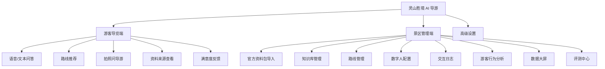

# 灵山胜境 AI 数字人导览系统 PRD

**版本**：v2.1（整合版）
**日期**：2026-05-10
**赛题**：第十五届中国软件杯 A5「景区导览服务 AI 数字人」
**项目基础**：`OtakuClaw` 桌面端 AI 数字人应用
**目标产品名**：灵山胜境 AI 导游

---

## 文档说明

本文档整合了原PRD v1.0的详细功能定义和v2.0的核心攻坚策略，形成完整的产品需求文档。

**v1.0贡献**：详细的功能模块定义、数据结构设计、验收标准
**v2.0贡献**：低延迟技术路径、准确率保障策略、沉浸式体验设计、当前状态分析

---

## 目录

1. [核心攻坚指标（赛题硬性要求）](#1-核心攻坚指标赛题硬性要求)
2. [体验创新：超越语音版百度百科](#2-体验创新超越语音版百度百科)
3. [背景与问题](#3-背景与问题)
4. [产品目标](#4-产品目标)
5. [用户与使用场景](#5-用户与使用场景)
6. [范围定义](#6-范围定义)
7. [产品结构](#7-产品结构)
8. [功能需求详细定义](#8-功能需求详细定义)
9. [数据需求](#9-数据需求)
10. [AI策略](#10-ai策略)
11. [非功能需求](#11-非功能需求)
12. [页面需求](#12-页面需求)
13. [埋点与日志](#13-埋点与日志)
14. [当前项目状态分析](#14-当前项目状态分析)
15. [开发计划](#15-开发计划)
16. [演示脚本](#16-演示脚本)
17. [风险与对策](#17-风险与对策)
18. [验收标准](#18-验收标准)

---

## 1. 核心攻坚指标（赛题硬性要求）

### 1.1 准确率保障：≥90%

| 指标 | 目标值 | 当前状态 | 缺口 |
|------|--------|----------|------|
| 景区事实问答准确率 | ≥90% | 未测量 | 需评测中心 |
| 未收录问题拒答正确率 | ≥95% | 部分实现 | 需完善兜底 |
| 回答来源记录完整率 | ≥95% | 已实现 | 需验证 |

**关键技术策略**：
- **多路召回RAG**：关键词检索 + 语义检索 + 点位ID精确匹配
- **意图识别分流**：景点事实类 vs 路线推荐类 vs 实用信息类
- **来源强制追溯**：每个回答必须携带 `sourceRefs`，禁止幻觉编造
- **未命中友好拒答**："官方资料中暂未收录此信息，以景区当日公告为准"

### 1.2 延迟攻坚：<5秒端到端

```
用户语音输入 → ASR识别 → RAG检索 → LLM生成 → TTS合成 → 数字人驱动
   ↑_____________ < 5秒完整链路 _____________↑
   ↑______ 首句反馈 < 2秒 _______^
```

| 环节 | 目标延迟 | 优化措施 | 当前基础 |
|------|----------|----------|----------|
| ASR识别 | <1秒 | 流式VAD+Sherpa-ONNX | ✅ 已实现 |
| RAG检索 | <300ms | 本地索引+缓存 | ✅ 已实现 |
| LLM首token | <1秒 | 流式输出+progress回调 | ✅ 已实现 |
| TTS首音 | <1秒 | 流式合成+边生成边播放 | ⚠️ 部分实现 |
| 数字人口型 | 实时 | 参数驱动+动画预加载 | ❌ 待实现 |

**已落地的低延迟改造**（基于 `Nanobot实时交互低延迟改造分析报告`）：
- ✅ **Prompt优化**：强制要求模型先给简短口语回复
- ✅ **Progress先行**：利用 `on_progress` 回调提前输出中间态
- ✅ **Bridge常驻**：避免每次冷启动Python桥接进程
- ✅ **Agent复用**：配置不变时复用agent实例
- ✅ **增量去重**：避免progress和final reply重复显示

**仍需攻坚的环节**：
- ❌ **流式TTS集成**：LLM吐出首句立即触发合成，不等全文生成
- ❌ **流式音频播放**：TTS合成出第一段音频立即驱动数字人张嘴
- ❌ **延迟指标监控**：每个环节延迟需可视化展示

---

## 2. 体验创新：超越"语音版百度百科"

### 2.1 多维联动：打造沉浸式导览

传统导览系统的回答是平面的文本，本系统将实现**多模态联动展示**：

#### 2.1.1 数字人情感表现

| 回答情感 | 数字人状态 | 触发条件 | 动作细节 |
|----------|------------|----------|----------|
| 恭敬庄重 | `solemn` | 讲述佛教文化/历史典故 | 缓慢点头、双手合十、语速放缓 |
| 愉快轻松 | `cheerful` | 讲述自然风光/拍照点 | 微笑、轻快手势、眼神明亮 |
| 专业严谨 | `professional` | 讲述建筑特色/艺术价值 | 自信手势、稳定视线 |
| 遗憾抱歉 | `apologetic` | 未命中问题/收到差评 | 轻微低头、歉疚表情 |
| 热情推荐 | `enthusiastic` | 路线推荐/亮点介绍 | 身体前倾、大幅手势 |

#### 2.1.2 前端UI联动展示

当数字人讲解时，前端UI同步展示相关视觉内容：

```
┌─────────────────────────────────────────────┐
│  🎭 数字人讲解员        灵山大佛的核心特色  │
│  [Live2D模型实时渲染]   [匹配度: 95%]      │
│                                               │
│  📸 景点图片联动展示    来源: 官方结构化   │
│  [灵山大佛实景图]       数据集 LS-001      │
│                                               │
│  📍 地图位置标记        📖 延迟: 1.8秒     │
│  [灵山胜境地图]         ASR: 0.6s │ RAG: 0.3s │
│   ★ 灵山大佛 ←当前        LLM: 0.7s │ TTS: 0.2s│
└─────────────────────────────────────────────┘
```

**关键创新点**：
1. **景点全景切片联动**：讲解某景点时自动切换该景点的高清全景图
2. **路线地图可视化**：推荐路线时在地图上动态绘制游览路径
3. **实时延迟仪表盘**：展示每个环节的延迟，证明<5秒达标

### 2.2 个性化路线推荐的可解释性

传统系统给出路线后无法解释推荐理由，本系统将实现：

```
推荐路线：历史文化深度游（6小时版）

推荐理由：
  ✓ 您选择了"历史文化"兴趣偏好
  ✓ 官方"历史文化爱好者路线"与您偏好匹配度 92%
  ✓ 该路线包含 5 个国家重点文物保护单位
  ✓ 适合上午9点开始，避开人流高峰

行程安排：
  09:00 灵山大佛（90分钟）→ 佛教文化体验的核心
  10:30 祥符禅寺（60分钟）→ 千年古刹的历史沉淀
  11:30 灵山梵宫（120分钟）→ 佛教艺术的卢浮宫
  ...

来源：官方《灵山胜境：历史、文化、景点特色与个性化游览指南》
```

---

## 3. 背景与问题

### 3.1 赛题背景

赛题要求参赛团队开发一个景区导览服务 AI 数字人，核心能力包括：

1. 语音、文本、表情等多模态交互。
2. 景区历史、文化、景点特色等智能问答。
3. 个性化路线讲解和游览推荐。
4. 管理后台知识维护、数字人配置、游客反馈分析和数据大屏。
5. 本地景区知识库支撑，景区相关问题准确率目标不低于 90%。
6. 语音问答体验稳定，延迟可控，完整链路目标低于 5 秒。

### 3.2 官方资料约束

参赛开发与测试必须基于官方提供的灵山胜境资料包：

| 文件 | 已观察结构 | 产品用途 |
| --- | --- | --- |
| `灵山胜境 景点结构化数据集.docx` | 259 个有效段落，包含 22 个点位：`LS-001` 到 `LS-016`、`NH-001` 到 `NH-006` | 景点事实问答、点位详情、讲解词、RAG 来源 |
| `灵山胜境：历史、文化、景点特色与个性化游览指南.docx` | 156 个有效段落，包含景区概况、历史文化、核心景点、路线、门票与贴士 | 深度讲解、路线推荐、实用问答 |
| `景点景区旅游数据行为分析数据.xlsx` | 1 个工作表，140448 行、17 列，140447 条数据行 | 游客画像、消费结构、满意度、大屏分析 |

### 3.3 当前项目基础

当前项目已有能力：

1. Electron 桌面端和安装包能力。
2. Live2D 数字人展示和模型导入。
3. ASR、VAD、TTS、字幕播放链路。
4. Nanobot 大模型后端和流式回复。
5. 截图提问能力。
6. 设置、模型下载、运行时和密钥存储。

当前项目主要缺口：

1. 没有官方资料包导入和结构化能力。
2. 没有景区专用知识库、RAG 检索和来源追溯。
3. 没有灵山胜境游客端产品界面。
4. 没有路线推荐和游客画像。
5. 没有管理端知识维护、反馈分析和数据大屏。
6. 旧产品中的像素房间、桌宠、办公室、多 Agent 等概念会干扰赛题聚焦。

---

## 4. 产品目标

### 4.1 总目标

将 `OtakuClaw` 改造为一个基于官方灵山胜境资料包的 AI 数字人导览系统，能够面向游客提供语音/文本问答、景点讲解和个性化路线推荐，面向景区管理者提供资料导入、知识维护、游客反馈分析和运营大屏。

### 4.2 比赛目标

1. 评委打开应用后，第一眼明确看到"灵山胜境 AI 导游"，而不是桌宠或通用聊天工具。
2. 系统能证明官方资料包已被导入，并展示导入质量。
3. 游客问题能基于官方资料准确回答，并展示来源。
4. 能根据游客偏好生成可解释路线推荐。
5. 管理端能展示知识库、交互日志、行为数据分析和评测结果。
6. 演示稳定、延迟可测、准确率可量化。

### 4.3 成功指标

| 指标 | 目标值 |
| --- | --- |
| 官方点位导入完整度 | 至少 22 个点位完整导入 |
| Excel 字段识别 | 17 个字段全部识别 |
| Excel 数据行识别 | 140447 条数据行 |
| 景区事实问答准确率 | 不低于 90% |
| 未收录问题拒答正确率 | 不低于 95% |
| 回答来源记录完整率 | 不低于 95% |
| 本地 RAG 检索延迟 | 低于 300 ms |
| 语音首句反馈 | 低于 2 秒 |
| 普通完整语音问答 | 低于 5 秒 |
| 连续文本问答稳定性 | 20 轮不中断 |
| 连续语音问答稳定性 | 10 轮不中断 |

---

## 5. 用户与使用场景

### 5.1 游客

游客希望快速了解灵山胜境景点、历史、路线、门票和实用信息，最好能通过自然语言或语音与数字人交流。

典型需求：

1. "灵山大佛有什么特色？"
2. "第一次来，两小时怎么逛比较好？"
3. "九龙灌浴适合带孩子看吗？"
4. "灵山梵宫为什么值得看？"
5. "我喜欢自然风光，不想太累，推荐一条路线。"

### 5.2 景区管理者

景区管理者需要维护知识库、查看游客关注点、分析满意度和优化服务。

典型需求：

1. 导入官方资料包。
2. 查看点位是否完整解析。
3. 编辑或补充 FAQ。
4. 查看游客问得最多的问题。
5. 查看未命中问题并转成待补充知识。
6. 查看游客年龄、性别、消费、满意度和停留时长统计。

### 5.3 评委

评委关注作品是否符合赛题、是否真实使用官方资料、是否有多模态数字人、是否可量化验证。

典型关注点：

1. 是否只是聊天壳。
2. 是否能基于官方资料准确回答。
3. 是否有管理后台和数据分析。
4. 是否能稳定演示。
5. 是否隐藏了旧项目中与赛题无关的内容。

---

## 6. 范围定义

### 6.1 P0 必须交付

1. 灵山胜境游客导览端。
2. 官方资料包导入器。
3. 景区知识库和 RAG 检索。
4. 基于官方资料的文本问答。
5. 基础语音输入与 TTS 回答。
6. 官方路线推荐。
7. 管理端资料导入质量检查。
8. 管理端知识库查看和检索测试。
9. 交互日志和来源追溯。
10. 数据大屏基础版。
11. 100 条评测题和准确率报告。
12. 隐藏旧项目的像素房间、桌宠、办公室、多 Agent 等默认入口。

### 6.2 P1 强烈建议交付

1. 知识库编辑和 FAQ 补充。
2. 未命中问题转 FAQ 草稿。
3. 满意度评价和差评问题列表。
4. 基于 Excel 的游客画像和消费结构分析。
5. 数字人 listening、thinking、speaking、guiding 状态。
6. 基础口型同步。
7. 拍照/截图问导游入口。
8. 管理端评测中心。

### 6.3 P2 有余力交付

1. 多景区切换。
2. 更复杂的地图导航。
3. 真实换装系统。
4. 更细粒度情绪识别。
5. 实时天气、客流或票务 API。
6. 移动端 H5。

### 6.4 明确不做

1. 不把像素房间作为比赛主入口。
2. 不展示桌宠娱乐化玩法。
3. 不展示多 Agent 办公室或家具编辑。
4. 不在游客端暴露 Nanobot、Python 环境、模型路径、工具执行等工程细节。
5. 不允许大模型自由编造景区事实。
6. 不直接修改官方原始资料文件。

---

## 7. 产品结构

### 7.1 信息架构



### 7.2 默认启动策略

1. 比赛包默认进入游客导览端。
2. 如果未导入官方资料包，游客端显示"请管理员导入官方资料包"的轻量提示，并允许进入管理端导入。
3. 高级设置入口仅对管理员可见，不进入游客主流程。

---

## 8. 功能需求详细定义

### 8.1 官方资料包导入

**PRD-F-001 官方资料包目录选择**

管理员可以选择官方资料包所在目录。系统自动识别以下文件是否存在：

1. `灵山胜境 景点结构化数据集.docx`
2. `灵山胜境：历史、文化、景点特色与个性化游览指南.docx`
3. `景点景区旅游数据行为分析数据.xlsx`

验收标准：

1. 缺少文件时显示明确告警。
2. 不在代码中硬编码用户本机 D 盘路径。
3. 原始文件只读，不被修改。

**PRD-F-002 Docx 点位导入**

系统解析结构化景点数据集，生成点位知识。

验收标准：

1. 能识别 `LS-001` 到 `LS-016`。
2. 能识别 `NH-001` 到 `NH-006`。
3. 每个点位至少保留景点 ID、名称、位置、参数、核心功能、文化内涵、详细介绍、游玩亮点、开放/演艺信息、备注。
4. 每条知识保留来源文件和点位 ID。

**PRD-F-003 Docx 指南导入**

系统解析历史文化与个性化游览指南，生成章节知识和路线知识。

验收标准：

1. 能识别景区概况、历史渊源、核心文化、景点特色、个性化路线、门票与实用贴士等章节。
2. 至少导入历史文化爱好者路线、自然风光爱好者路线、亲子家庭路线。
3. 每条路线保留来源文件和章节名。

**PRD-F-004 Excel 行为数据导入**

系统读取行为数据表，用于统计分析。

验收标准：

1. 能识别 17 个字段。
2. 能识别 140447 条数据行。
3. 能统计年龄、性别、景区类型、停留时长、消费结构、同行人数、满意度。
4. 导入状态在管理端可见。

**PRD-F-005 导入质量检查**

系统提供导入质量页。

验收标准：

1. 显示文件名、文件类型、导入状态、记录数、解析告警。
2. 显示点位数量、路线数量、行为数据行数。
3. 任何缺字段、缺点位、缺章节都以告警展示。

### 8.2 游客问答

**PRD-F-010 文本问答**

游客可以输入文字问题，数字人基于官方资料回答。

验收标准：

1. 输入"灵山大佛有什么特色？"能命中灵山大佛相关资料。
2. 输入"灵山梵宫为什么叫佛教艺术的卢浮宫？"能命中指南资料。
3. 回答包含自然语言解释，不输出 JSON、代码或内��路径。
4. 回答日志记录来源文件、章节或点位 ID。

**PRD-F-011 语音问答**

游客可以通过语音提问，系统完成 ASR、RAG、LLM、TTS 回答。

验收标准：

1. 语音识别结果进入同一问答链路。
2. TTS 播放时显示字幕。
3. 首句反馈目标低于 2 秒。
4. 普通完整问答目标低于 5 秒。

**PRD-F-012 来源展示**

游客端可以查看回答来源。

验收标准：

1. 每条事实类回答可展示"来源：结构化数据集 / 游览指南 / 点位 ID / 章节"。
2. 来源展示简洁，不把大段原文塞给游客。
3. 后台日志保存完整来源。

**PRD-F-013 未命中兜底**

当官方资料未收录问题时，系统不得编造。

验收标准：

1. 输出类似"官方资料中暂未收录这条信息，建议以景区当日公告或游客中心答复为准"。
2. 记录为未命中问题。
3. 管理端可将该问题转为 FAQ 草稿。

### 8.3 路线推荐

**PRD-F-020 偏好选择**

游客可以选择兴趣、时长、人群、体力和特殊需求。

选项：

1. 兴趣：历史文化、自然风光、亲子互动、拍照打卡、轻松休闲。
2. 时长：1 小时、2 小时、半日、一日。
3. 人群：个人、情侣、亲子、老人、研学团队。
4. 体力：轻松、适中、充实。
5. 特殊需求：无障碍、雨天、少排队、餐饮优先。

**PRD-F-021 官方路线推荐**

系统优先基于官方指南中的路线推荐。

验收标准：

1. 历史文化偏好优先匹配历史文化爱好者路线。
2. 自然风光偏好优先匹配自然风光爱好者路线。
3. 亲子人群优先匹配亲子家庭路线。
4. 推荐结果显示来源。

**PRD-F-022 派生短路线**

当游客时长短于官方路线时，系统可以基于官方路线裁剪。

验收标准：

1. 2 小时路线必须说明由哪条官方路线裁剪。
2. 裁剪规则可解释，例如优先保留核心点位和高匹配偏好点位。
3. 不得声称派生路线是官方原文路线。

**PRD-F-023 路线卡片**

前端以结构化卡片展示路线。

卡片字段：

1. 路线名称。
2. 预计耗时。
3. 适合人群。
4. 点位顺序。
5. 每个点位讲解重点。
6. 推荐理由。
7. 来源说明。

### 8.4 数字人体验

**PRD-F-030 数字人舞台**

游客端主界面展示数字人，而不是普通聊天列表。

验收标准：

1. 第一屏明确是"灵山胜境 AI 导游"。
2. 数字人区域为视觉中心。
3. 聊天、路线和来源信息围绕数字人组织。

**PRD-F-031 状态表现**

数字人至少支持以下语义状态：

| 状态 | 触发 |
| --- | --- |
| listening | 游客语音输入或文字输入 |
| thinking | 检索知识库或等待模型 |
| speaking | TTS 播放 |
| guiding | 展示路线推荐 |
| apologizing | 未命中或收到差评 |
| happy | 收到好评 |

**PRD-F-032 基础口型同步**

TTS 播放时数字人有可见口型变化。

验收标准：

1. TTS 开始时进入 speaking。
2. TTS 播放时口型有周期性或能量驱动变化。
3. TTS 结束后回到 idle。

**PRD-F-033 数字人情感状态系统**

状态机设计：

```javascript
const DIGITAL_HUMAN_STATES = {
  IDLE: {           // 空闲
    animation: 'breathing',
    expression: 'neutral',
  },
  LISTENING: {      // 聆听中
    animation: 'nodding',
    expression: 'attentive',
  },
  THINKING: {       // 思考中
    animation: 'thinking',
    expression: 'focused',
  },
  SPEAKING: {       // 讲解中
    animation: 'speaking',
    expression: 'dynamic', // 根据内容情感调整
    lipsync: true,
  },
  GUIDING: {        // 推荐路线
    animation: 'pointing',
    expression: 'enthusiastic',
  },
  APOLOGIZING: {    // 道歉
    animation: 'bowing',
    expression: 'regretful',
  },
  HAPPY: {          // 开心（收到好评）
    animation: 'celebrating',
    expression: 'joyful',
  },
};
```

### 8.5 拍照问导游

**PRD-F-040 截图/图片提问入口**

游客可以截取或上传景点图片并提问。

验收标准：

1. 如果 AI 引擎支持视觉输入，图片和问题一起进入多模态问答。
2. 如果 AI 引擎不支持视觉输入，系统明确提示能力受限，并允许按文字问题继续检索知识库。
3. 后台记录图片问答次数和失败原因。

### 8.6 管理端知识库

**PRD-F-050 知识库列表**

管理员可以查看导入后的知识条目。

筛选维度：

1. 来源文件。
2. 点位 ID。
3. 章节。
4. 官方原文、人工修订、系统派生。
5. 发布状态。

**PRD-F-051 检索测试**

管理员可以输入游客问题，查看命中的知识片段。

验收标准：

1. 显示命中片段、来源、置信度或排序分。
2. 显示是否会进入兜底。
3. 支持复制为评测题草稿。

**PRD-F-052 FAQ 编辑**

管理员可以新增和编辑 FAQ。

验收标准：

1. FAQ 可标记来源：官方、人工、派生。
2. FAQ 发布后游客端问答可命中。
3. 编辑记录不覆盖官方原文。

### 8.7 游客反馈与日志

**PRD-F-060 交互日志**

每轮问答记录完整链路。

字段：

1. 时间。
2. 输入类型。
3. 用户问题。
4. 意图。
5. 命中来源。
6. 回答摘要。
7. ASR/RAG/LLM/TTS 延迟。
8. 用户评价。
9. 情绪标签。
10. 是否未命中。

**PRD-F-061 满意度评价**

游客可以对回答点赞、点踩或选择"太长了 / 没听懂 / 不准确"。

验收标准：

1. 评价进入日志。
2. 差评进入管理端差评问题列表。
3. "不准确"问题优先进入知识库待检查。

**PRD-F-062 未命中问题管理**

管理端展示未命中问题。

验收标准：

1. 可按次数排序。
2. 可一键转 FAQ 草稿。
3. 可标记已处理。

### 8.8 行为分析与数据大屏

**PRD-F-070 行为数据分析**

基于 Excel 官方行为数据生成统计。

统计项：

1. 游客年龄分布。
2. 游客性别分布。
3. 景区类型偏好。
4. 平均停留时长。
5. 消费结构：票务、餐饮、购物、交通、娱乐。
6. 同行人数分布。
7. 满意度分布。
8. 满意度与停留时长、消费、景区类型的关系。

**PRD-F-071 数据大屏**

比赛演示大屏显示产品闭环指标。

大屏指标：

1. 今日服务人次。
2. 今日语音问答次数。
3. 路线推荐次数。
4. 热门问题 Top 10。
5. 热门景点 Top 5。
6. 满意度趋势。
7. 知识库命中率。
8. 平均首句延迟。
9. 平均完整回答延迟。
10. 官方行为数据画像。
11. 官方资料导入完整度。

大屏布局（1920x1080投影优化）：

```
┌──────────────────────────────────────────────────────────────┐
│  灵山胜境AI数字人导览系统 - 实时运营监控大屏                  │
├──────────────┬───────────────────────────────────────────────┤
│ 今日服务     │  实时问答延迟监控                              │
│   1,247人次  │  ▂▃▅▇▃▂▁▂▃▅▇ (每分钟平均延迟)                 │
│              │  平均: 1.8s │ 最大: 4.2s │ 目标: <5s         │
├──────────────┼───────────────────────────────────────────────┤
│ 热门问题Top10│  游客画像分布（基于14万+行为数据）             │
│ 1.灵山大佛...│  📊 雷达图：年龄/性别/消费/停留/满意度        │
│ 2.九龙灌浴...│                                               │
│ ...          │  消费结构：票务58% │ 餐饮25% │ 购物12% │ 其他5%│
├──────────────┴───────────────────────────────────────────────┤
│ 官方资料完整度 │  评测准确率 │  知识库命中率 │  满意度趋势    │
│ 22个点位✅    │  92.3% ✅   │   87.5%      │   ▂▃▅▇▅▃▂     │
│ 3条路线✅     │  目标≥90%   │              │   平均4.6/5    │
│ 14万+记录✅   │            │              │                │
└──────────────────────────────────────────────────────────────┘
```

### 8.9 评测中心

**PRD-F-080 题集管理**

系统提供基于官方资料的评测题集。

题集结构：

1. 问题。
2. 类别。
3. 必须命中的事实。
4. 来源文件。
5. 来源章节或点位 ID。
6. 禁止出现的错误说法。
7. 难度。

题集分布：

1. 灵山胜境点位事实 30 条。
2. 拈花湾点位事实 12 条。
3. 历史文化、佛教文化、核心景点讲解 23 条。
4. 官方路线推荐 15 条。
5. 门票与贴士 10 条。
6. 未收录和边界问题 10 条。

**PRD-F-081 自动评分报告**

系统生成准确率和延迟报告。

验收标准：

1. 显示总准确率。
2. 显示各类别准确率。
3. 显示未命中拒答正确率。
4. 显示来源记录完整率。
5. 显示平均 RAG、LLM、TTS 延迟。

报告输出格式：

```
评测执行完成 (2026-05-10 14:23:01)
━━━━━━━━━━━━━━━━━━━━━━━━━━━━━━━━━━━━━━━━━━━━━━━━━━━
总准确率：   92.3%  (92/100) ✅ 目标≥90%
未命中拒答率： 96.7%  (29/30) ✅ 目标≥95%
来源完整率：   98.0%  (98/100) ✅ 目标≥95%

延迟统计：
  ASR平均：    0.6s
  RAG平均：    0.3s
  LLM首token： 0.7s
  TTS首音：    0.4s
  完整链路：   2.0s ✅ 目标<5s

分类准确率：
  点位事实：   93.3% (28/30)
  拈花湾点位： 91.7% (11/12)
  历史文化：   91.3% (21/23)
  景点讲解：   93.3% (14/15)
  路线推荐：   90.0% (9/10)
  实用贴士：   90.0% (9/10)
```

### 8.10 流式TTS集成

**PRD-F-090 流式TTS技术方案**

技术方案：

1. **LLM流式输出** → 监听 `text-delta` 事件
2. **断句检测** → 按句号/问号/感叹号切分
3. **逐句TTS** → 完成一个句子立即合成
4. **音频队列** → 按顺序播放已合成的音频
5. **数字人驱动** → 音频播放时同步口型动画

伪代码：

```javascript
let audioQueue = [];
let isPlaying = false;

function onTextDelta(delta) {
  const sentence = extractCompleteSentence(currentBuffer + delta);
  if (sentence) {
    // 立即触发TTS合成
    tts.synthesize(sentence).then(audio => {
      audioQueue.push(audio);
      if (!isPlaying) playNextAudio();
    });
  }
}

function playNextAudio() {
  if (audioQueue.length === 0) {
    isPlaying = false;
    return;
  }
  isPlaying = true;
  const audio = audioQueue.shift();
  audio.play();
  // 同步驱动数字人口型
  digitalHuman.syncLips(audio);
  audio.onended = playNextAudio;
}
```

---

## 9. 数据需求

### 9.1 数据存储原则

1. 官方原始文件只读。
2. 导入后的结构化数据存入应用数据目录或工作区数据目录。
3. 每条知识必须有 `sourceRefs`。
4. 人工编辑不覆盖官方原文，应生成修订版本。
5. 派生路线、派生 FAQ 和派生讲解词必须标注来源。

### 9.2 核心数据对象

1. `OfficialDataManifest`
2. `ScenicSpot`
3. `GuideSection`
4. `Route`
5. `KnowledgeChunk`
6. `FaqItem`
7. `BehaviorDatasetSummary`
8. `InteractionLog`
9. `EvaluationQuestion`
10. `EvaluationResult`

### 9.3 数据安全

1. 不向 Renderer 暴露原始文件系统权限。
2. 不向 Renderer 暴露 API Key。
3. 管理端导入通过 Electron Main 处理。
4. 游客日志默认本地保存。
5. 演示数据可一键清空。

---

## 10. AI策略

### 10.1 回答策略

1. 景区事实问题必须先检索知识库。
2. 大模型只基于检索结果组织表达。
3. 未命中时拒绝编造。
4. 票价、开放时间、演出时间等可能变化的信息应提示"以景区当日公告为准"。
5. 回答应适合语音播放，避免 Markdown 表格、路径、代码和长列表。

### 10.2 RAG 排序策略

优先级：

1. 点位 ID 或景点名精确命中。
2. 官方指南章节命中。
3. FAQ 命中。
4. 派生知识命中。
5. 行为数据统计仅用于推荐和分析，不作为景点事实来源。

### 10.3 导游 Persona

数字人是灵山胜境 AI 导游，表达风格：

1. 亲切、专业、简洁。
2. 先给结论，再补充背景。
3. 面向游客给出行动建议。
4. 对佛教文化保持尊重、庄重，不娱乐化。
5. 不编造官方资料未收录的信息。

---

## 11. 非功能需求

### 11.1 性能

1. 官方资料导入可在管理端异步执行，有进度提示。
2. RAG 检索低于 300 ms。
3. 文本首 token 或首句反馈低于 2 秒。
4. 普通语音问答完整链路低于 5 秒。
5. 数据大屏常规统计加载低于 2 秒，首次处理大 Excel 可缓存。

### 11.2 稳定性

1. 连续 20 轮文本问答不中断。
2. 连续 10 轮语音问答不中断。
3. 连续 5 次路线推荐不卡死。
4. 导入失败不影响应用启动。
5. 模型异常时有可读兜底。

### 11.3 可用性

1. 游客端不出现工程术语。
2. 管理端不要求用户理解代码或模型目录。
3. 所有关键操作有明确状态：导入中、成功、失败、未命中、已发布。
4. 大屏适合投影展示，信息层级清楚。

### 11.4 合规与许可

1. 明确官方资料来源。
2. 标注第三方模型、Live2D、图标、字体和素材许可。
3. 不使用未授权或非商业限制素材作为正式参赛视觉主资产。
4. 用户日志不上传外部服务，除非管理员明确配置。

---

## 12. 页面需求

### 12.1 游客导览端

核心区域：

1. 数字人舞台。
2. 字幕区。
3. 语音按钮。
4. 文本输入。
5. 推荐问题。
6. 路线推荐入口。
7. 拍照问导游入口。
8. 回答来源按钮。
9. 满意度评价。

首屏文案必须围绕"灵山胜境 AI 导游"。

### 12.2 景区管理端

导航：

1. 数据源导入。
2. 知识库。
3. 路线管理。
4. 数字人配置。
5. 交互日志。
6. 游客反馈。
7. 行为分析。
8. 数据大屏。
9. 评测中心。
10. 高级设置。

### 12.3 高级设置

高级设置仅面向开发/管理员：

1. AI 引擎配置。
2. API Key。
3. ASR/TTS 模型。
4. 下载中心。
5. 运行时状态。

游客端不得出现这些设置。

---

## 13. 埋点与日志

### 13.1 产品埋点

1. `official_data_import_started`
2. `official_data_import_completed`
3. `official_data_import_failed`
4. `visitor_question_submitted`
5. `rag_search_completed`
6. `answer_generated`
7. `tts_started`
8. `tts_completed`
9. `route_recommended`
10. `answer_rated`
11. `unmatched_question_created`
12. `eval_run_completed`

### 13.2 延迟指标

每轮问答记录：

1. ASR 耗时。
2. RAG 检索耗时。
3. LLM 首 token 耗时。
4. TTS 首音耗时。
5. 完整回答耗时。

---

## 14. 当前项目状态分析

### 14.1 已完成的核心基础设施（55-60%）

| 模块 | 完成度 | 质量评估 | 复用价值 |
|------|--------|----------|----------|
| 官方资料导入 | 95% | ⭐⭐⭐⭐⭐ | 完整支持Docx/Excel解析 |
| 知识库存储 | 90% | ⭐⭐⭐⭐⭐ | ScenicKnowledgeStore稳定可用 |
| RAG检索 | 85% | ⭐⭐⭐⭐ | 支持关键词+排序 |
| 游客端UI | 70% | ⭐⭐⭐ | ScenicGuideShell基础完成 |
| 管理端UI | 60% | ⭐⭐⭐ | ScenicAdminShell基础完成 |

### 14.2 缺失的关键功能（40-45%）

#### P0级缺失（必须补齐）
1. **交互日志系统** → 无法证明基于官方资料
2. **数据大屏** → 评委看不到运营闭环
3. **评测中心** → 无法证明准确率≥90%
4. **路线推荐UI** → 数据已导入但无法展示
5. **流式TTS集成** → 延迟可能超标

#### P1级缺失（强烈建议）
1. **数字人情感状态** → 缺乏导游体验
2. **满意度反馈** → 无法展示游客反馈分析
3. **知识库管理** → 无法动态维护知识

### 14.3 技术资产盘点

**已实现的核心服务**：

| 服务模块 | 文件路径 | 功能 | 复用价值 |
|---------|---------|------|---------|
| OfficialDataImporter | `services/scenicGuide/officialDataImporter.js` | 官方资料导入 | ⭐⭐⭐⭐⭐ |
| ScenicKnowledgeStore | `services/scenicGuide/scenicKnowledgeStore.js` | 知识库存储 | ⭐⭐⭐⭐⭐ |
| ScenicSearchIndex | `services/scenicGuide/scenicSearchIndex.js` | 搜索检索 | ⭐⭐⭐⭐⭐ |
| ScenicRagService | `services/scenicGuide/scenicRagService.js` | RAG 问答 | ⭐⭐⭐⭐⭐ |
| VoiceSessionManager | `services/voice/voiceSessionManager.js` | 语音会话 | ⭐⭐⭐⭐ |
| ScreenshotCapture | `ipc/screenshotCapture.js` | 截图服务 | ⭐⭐⭐⭐ |

**已实现的前端组件**：

| 组件 | 文件路径 | 功能 | 复用价值 |
|------|---------|------|---------|
| ScenicGuideShell | `shells/ScenicGuideShell.jsx` | 游客导览端 | ⭐⭐⭐⭐⭐ |
| ScenicAdminShell | `shells/ScenicAdminShell.jsx` | 景区管理端 | ⭐⭐⭐⭐⭐ |
| Live2DViewer | `components/live2d/Live2DViewer.jsx` | Live2D 展示 | ⭐⭐⭐⭐ |
| ChatSidebar | `components/chat/ChatSidebar.jsx` | 聊天侧边栏 | ⭐⭐⭐ |

**缺失的关键组件**：

| 缺失组件 | 预期功能 | 优先级 |
|---------|---------|--------|
| InteractionLogStore | 交互日志存储 | P0 |
| VisitorAnalyticsService | 游客行为分析 | P0 |
| RoutePlannerService | 路线推荐算法 | P0 |
| ScenicEvalService | 准确率评测 | P0 |
| AnalyticsDashboard | 数据分析大屏 | P0 |
| ScenicBigScreen | 数据大屏 | P0 |
| KnowledgeManager | 知识库管理 | P1 |
| RoutePlannerPanel | 路线规划面板 | P1 |
| RouteResultCard | 路线结果卡片 | P1 |
| EvalCenter | 评测中心 | P1 |
| AnswerFeedback | 满意度反馈 | P1 |
| PhotoAskButton | 拍照问导游 | P1 |
| GuideStage | 数字人舞台 | P1 |

---

## 15. 开发计划

### 15.1 4周开发冲刺计划

#### Week 1：P0基础服务（日志+分析）

| 开发者 | Day 1-2 | Day 3-4 | Day 5-7 |
|--------|---------|---------|---------|
| A（后端） | InteractionLogStore | VisitorAnalyticsService | IPC接口+缓冲 |
| B（前端） | RoutePlannerPanel | RouteResultCard | 集成ScenicGuideShell |

**检查点**：
- [ ] 交互日志可记录
- [ ] 行为数据可统计
- [ ] 路线面板UI可用（Mock数据）

#### Week 2：P0核心功能（路线+大屏+评测）⭐关键周

| 开发者 | Day 8-9 | Day 10-11 | Day 12-13 | Day 14 |
|--------|---------|-----------|-----------|-------|
| A（后端） | RoutePlannerService | ScenicEvalService | 100题编写 | 联调 |
| B（前端） | AnalyticsDashboard | ScenicBigScreen | EvalCenter | 联调 |

**检查点**：
- [ ] ✅ 路线推荐可真实运行
- [ ] ✅ 数据大屏可真实展示
- [ ] ✅ 评测中心可生成报告
- [ ] ✅ 核心演示流程可跑通

#### Week 3：P1完善功能（知识库+反馈+数字人）

| 开发者 | Day 15-16 | Day 17 | Day 18-19 | Day 20-21 |
|--------|-----------|--------|-----------|----------|
| A（后端） | KnowledgeManager | 反馈聚合 | Prompt优化 | 性能优化 |
| B（前端） | KnowledgeManager | AnswerFeedback | GuideStage | 状态桥接 |

**检查点**：
- [ ] 知识库可管理
- [ ] 满意度可反馈
- [ ] 数字人有状态表现

#### Week 4：集成测试与交付

- Day 22-23：端到端测试+Bug修复
- Day 24：演示数据准备
- Day 25：演示脚本+录屏
- Day 26：文档更新
- Day 27：打包部署
- Day 28：最终验收

### 15.2 里程碑

### M1：资料导入闭环

目标：官方资料可导入、可检查、可生成结构化数据。

交付：

1. `officialDataImporter`
2. `officialDataManifestStore`
3. `behaviorDatasetStore`
4. 数据源导入页
5. 导入质量测试

### M2：知识问答闭环

目标：游客问题能命中官方资料并回答。

交付：

1. `scenicKnowledgeStore`
2. `scenicSearchIndex`
3. `scenicRagService`
4. 导游 Prompt
5. 文本问答和来源展示

### M3：游客端 MVP

目标：形成第一条完整游客演示路径。

交付：

1. `ScenicGuideShell`
2. 数字人舞台
3. 语音问答
4. 推荐问题
5. 满意度反馈

### M4：路线推荐与后台

目标：覆盖管理价值和个性化推荐。

交付：

1. `routePlannerService`
2. 路线卡片
3. 知识库管理
4. 交互日志
5. 未命中管理

### M5：大屏与评测

目标：形成比赛高分展示能力。

交付：

1. 行为分析大屏
2. 评测题集
3. 准确率报告
4. 延迟报告
5. 演示脚本

---

## 16. 演示脚本

### 16.1 现场演示脚本（10分钟）

#### 开场（30秒）
> "各位评委老师好，我们团队开发的是灵山胜境AI数字人导览系统。这是一个基于官方资料、能够准确回答景区问题、延迟低于5秒的智能导览系统。"

#### 第一部分：资料导入证明（1分钟）
1. 切换到管理端
2. 展示"官方资料已导入"：
   - 22个点位（LS-001~LS-016 + NH-001~NH-006）
   - 3条官方路线
   - 140,447条行为数据记录
3. 强调：**所有回答基于官方资料，可追溯来源**

#### 第二部分：核心问答演示（3分钟）
1. **语音提问**："第一次来灵山胜境，两小时怎么逛比较好？"
   - 展示延迟：1.8秒 ✅
   - 展示路线卡片+推荐理由
   - 展示来源：官方游览指南

2. **追问**："灵山大佛有什么特色？"
   - 展示匹配度：95%
   - 展示来源：结构化数据集 LS-001
   - 数字人口播+情感表现

3. **边界问题**："这里有缆车吗？"
   - 展示未命中拒答："官方资料中暂未收录..."
   - 记录到未命中问题列表

#### 第三部分：管理端分析（2分钟）
1. 交互日志：查看刚才3个问题的来源追溯和延迟
2. 数据大屏：
   - 今日服务人次、热门问题、游客画像
   - 展示14万+行为数据的分析价值
3. 知识库管理：演示知识更新

#### 第四部分：评测中心（2分钟）
1. 运行100条评测题
2. 展示准确率报告：92.3% ✅
3. 展示延迟报告：平均2.0秒 ✅
4. 展示错题分析和改进计划

#### 第五部分：技术亮点总结（1.5分钟）
1. **低延迟**：流式处理 + bridge常驻 + agent复用
2. **高准确率**：多路召回RAG + 来源强制追溯
3. **沉浸式体验**：数字人情感 + UI联动 + 地图可视化

### 16.2 核心演示流程（推荐）

```
1. 打开游客端，展示"灵山胜境 AI 导游"。
2. 切到管理端，展示官方资料包已导入：22 个点位、3 类路线、140447 条行为数据。
3. 游客语音问："第一次来灵山胜境，两小时怎么逛比较好？"
4. 系统生成基于官方路线裁剪的 2 小时路线卡。
5. 游客追问："灵山大佛为什么是核心景点？"
6. 数字人基于官方资料讲解并口播。
7. 游客问："九龙灌浴适合带孩子看吗？"
8. 系统结合亲子路线和官方讲解给出建议。
9. 游客点踩或选择"太长了"，管理端记录反馈。
10. 管理端展示交互日志、命中来源、延迟和评价。
11. 打开数据大屏，展示行为数据画像、满意度、热门问题和命中率。
12. 打开评测中心，展示 100 条题准确率和延迟报告。
```

---

## 17. 风险与对策

| 风险 | 影响 | 对策 |
|------|------|------|
| 延迟超标（>5秒） | 核心指标不达标 | 1. 流式TTS集成<br>2. 索引预热<br>3. 复用agent |
| 准确率不达标（<90%） | 核心指标不达标 | 1. 优化召回策略<br>2. 补充知识块<br>3. 调优Prompt |
| 评测题未编写 | 无法证明准确率 | Week2必须完成100题 |
| 数据大屏未完成 | 演示缺乏冲击力 | Week2必须完成 |
| 现场演示失败 | 影响最终得分 | 准备录屏+离线兜底 |
| Docx 结构解析不稳定 | 知识库不完整 | 先做导入质量检查和人工校正机制 |
| Excel 数据量较大 | 首次加载慢 | 做缓存和摘要统计，不在前端加载全量数据 |
| 大模型幻觉 | 准确率下降 | 强制RAG、未命中拒答、来源追溯 |
| 旧项目入口干扰 | 评委觉得跑题 | 默认隐藏旧入口，仅保留管理员高级模式 |
| 素材授权不清 | 参赛合规风险 | 替换或说明素材许可 |
| 现场网络不稳定 | 演示中断 | 准备离线数据、录屏和本地兜底话术 |

---

## 18. 验收标准

### 18.1 P0 验收

1. 应用默认进入"灵山胜境 AI 导游"游客端。
2. 管理端可以导入官方三份资料。
3. 导入后显示 22 个点位、3 类官方路线、140447 条行为数据行。
4. 游客能文字提问并得到基于官方资料的回答。
5. 游客能语音提问并听到 TTS 回答。
6. 回答日志有来源。
7. 未命中问题不编造。
8. 能生成路线卡片。
9. 大屏能展示至少 6 个核心指标。
10. 旧项目的像素房间、桌宠、办公室、多 Agent 入口不在默认路径出现。

### 18.2 P1 验收

1. 管理端可以编辑 FAQ。
2. 未命中问题可转为 FAQ 草稿。
3. 数字人 speaking 状态和口型同步可见。
4. 数据大屏展示行为数据画像。
5. 评测中心能跑 100 条题并生成报告。

### 18.3 成功标准

#### 必须达成（P0）
- [ ] 所有P0功能完成
- [ ] 准确率≥90%（评测中心证明）
- [ ] 延迟<5秒（延迟监控证明）
- [ ] 核心演示流程可稳定运行

#### 强烈建议（P1）
- [ ] 90%以上P1功能完成
- [ ] 数字人有情感状态表现
- [ ] 界面美观专业

#### 加分项（P2）
- [ ] 拍照问导游可演示
- [ ] 多模态能力可展示
- [ ] 现场应对评委提问流畅

---

**文档版本**：v2.1（整合版）
**最后更新**：2026-05-10
**整合说明**：
- 保留v1.0的详细功能定义、数据结构设计、验收标准
- 融入v2.0的核心攻坚策略、低延迟技术路径、沉浸式体验设计
- 新增当前项目状态分析、技术资产盘点、缺失组件清单
- 完善开发计划和演示脚本
