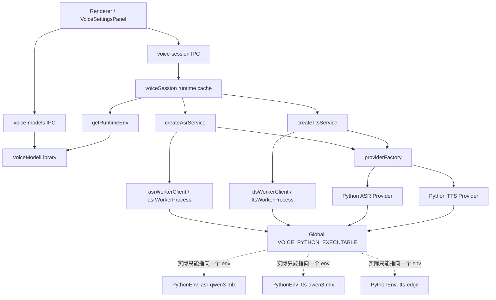
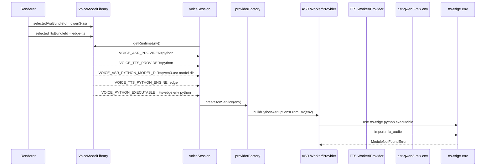
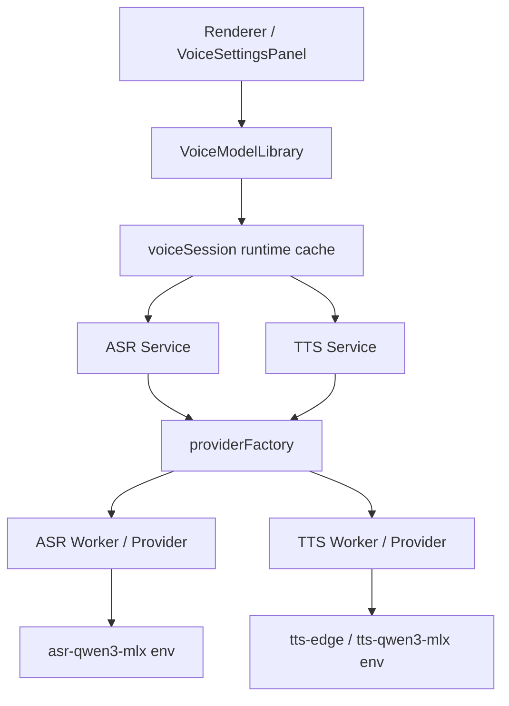

# 语音 Python 双 Env 架构冲突分析与修复设计（2026-03-07）

## 1. 背景

当前桌面端语音栈已经完成了两项重要演进：

1. Python 解释器从语音 bundle 中抽离，提升为应用级共享 runtime。
2. ASR/TTS 的 Python 依赖被拆到隔离 env 中，例如：
   - `asr-qwen3-mlx`
   - `tts-qwen3-mlx`
   - `tts-edge`

这套设计的目标本身是正确的，但当前实现里仍保留了一个旧约束：

1. 运行时只存在一个全局 `VOICE_PYTHON_EXECUTABLE`
2. ASR/TTS 的 Python provider 都从这个全局字段读取解释器路径

这与“ASR/TTS 可分别绑定不同 Python env”的设计目标发生了直接冲突。

最近又新增了两项能力：

1. 启动时预热已选中的 ASR/TTS 模型
2. 切换模型后主动卸载并预热新模型

因此，这个冲突从“潜在问题”变成了“启动即可复现的问题”。

## 2. 当前架构的设计意图

当前语音系统的高层设计意图是：

1. Renderer 只负责模型选择、测试和语音会话交互。
2. Electron main process 负责模型状态、运行时解析、provider 选择、worker 进程管理。
3. PythonRuntimeManager 提供共享 CPython。
4. PythonEnvManager 提供按 profile 隔离的依赖 env。
5. VoiceModelLibrary 负责把“当前选中的 ASR/TTS bundle”解析为运行时环境变量。
6. ASR/TTS service 再根据环境变量构造 provider 或 worker client。

换句话说，设计意图是：

1. 资源层面共享 runtime
2. 依赖层面隔离 env
3. 运行时层面允许 ASR/TTS 分别绑定不同 provider / 模型 / env

## 3. 当前实际架构图

## 4. 当前架构中各组件的职责

### 4.1 Renderer

主要组件：

1. `front_end/src/components/config/VoiceSettingsPanel.jsx`

职责：

1. 展示内置模型 catalog
2. 触发下载、安装、选择
3. 触发 ASR/TTS 诊断

它不直接管理 Python env，只通过 IPC 发请求。

### 4.2 模型状态层

主要组件：

1. `desktop/electron/ipc/voiceModels.js`
2. `desktop/electron/services/voice/voiceModelLibrary.js`

职责：

1. 持久化 `selectedAsrBundleId` / `selectedTtsBundleId`
2. 解析 bundle 对应的运行时资源
3. 输出 `getRuntimeEnv()`

这里是当前冲突的源头之一，因为它会把双选择状态压平成一份全局 env。

### 4.3 会话与预热层

主要组件：

1. `desktop/electron/ipc/voiceSession.js`
2. `desktop/electron/main.js`

职责：

1. 创建并缓存 ASR/TTS service
2. 管理录音、转写、分句、TTS 播放
3. 在启动和模型切换后触发 `warmupRuntime()`

这一层本身没有设计错误，但它会更快暴露底层 env 冲突。

### 4.4 Provider / Worker 层

主要组件：

1. `desktop/electron/services/voice/asrService.js`
2. `desktop/electron/services/voice/ttsService.js`
3. `desktop/electron/services/voice/providerFactory.js`
4. `desktop/electron/services/voice/asrWorkerClient.js`
5. `desktop/electron/services/voice/asrWorkerProcess.js`
6. `desktop/electron/services/voice/ttsWorkerClient.js`
7. `desktop/electron/services/voice/ttsWorkerProcess.js`

职责：

1. 读取 env
2. 选择 `mock` / `sherpa-onnx` / `python`
3. 把 Python provider 隔离到 worker 或子进程中执行

问题在于：

1. ASR provider 和 TTS provider 都依赖同一个全局 Python executable
2. 这让 provider 层无法真正落实“隔离 env”

### 4.5 Python 资源层

主要组件：

1. `desktop/electron/services/python/pythonRuntimeManager.js`
2. `desktop/electron/services/python/pythonEnvManager.js`
3. `desktop/electron/services/voice/voiceModelCatalog.js`

职责：

1. 管理共享 CPython
2. 管理 profile 级虚拟环境
3. 声明模型所需 pip 依赖

这层的设计目标是正确的，当前问题不在这里。

## 5. 当前设计的关键运行契约

当前代码的真实契约如下。

### 5.1 选择状态是双路的

`VoiceModelLibrary` 已经支持：

1. `selectedAsrBundleId`
2. `selectedTtsBundleId`

这意味着“状态模型”允许 ASR/TTS 分别来自两个 bundle。

### 5.2 解释器路径却是单路的

`VoiceModelLibrary#getRuntimeEnv()` 当前会先解析 TTS 的 Python runtime，再回退到 ASR 的 Python runtime：

1. `resolvePythonRuntime(selectedTtsBundle) || resolvePythonRuntime(selectedAsrBundle)`
2. 然后写入全局 `env.VOICE_PYTHON_EXECUTABLE`

结果是：

1. 运行态只保留了一个 Python 解释器路径
2. 这个解释器被 ASR/TTS 共同消费

### 5.3 ASR/TTS provider 都读同一解释器字段

`providerFactory.js` 当前的行为：

1. `buildPythonAsrOptionsFromEnv()` 读取 `VOICE_PYTHON_EXECUTABLE`
2. `buildPythonTtsOptionsFromEnv()` 也读取 `VOICE_PYTHON_EXECUTABLE`

因此：

1. 即便 ASR/TTS 模型、语言、engine、modelDir 是分开的
2. 它们最终仍被塞进同一个 Python env 中执行

## 6. 架构冲突发生在哪几个组件之间

这不是单点 bug，而是多个组件之间的契约冲突。

### 6.1 `VoiceModelLibrary` 与 `PythonEnvManager` 的冲突

冲突点：

1. `PythonEnvManager` 明确提供“多 env 并存”的能力
2. `VoiceModelLibrary#getRuntimeEnv()` 却把运行态压扁成一个全局 Python executable

本质：

1. 资源层是多 env
2. 运行时契约却是单 env

### 6.2 `VoiceModelLibrary` 与 `providerFactory` 的冲突

冲突点：

1. `VoiceModelLibrary` 支持双选择：`selectedAsrBundleId` / `selectedTtsBundleId`
2. `providerFactory` 只支持单解释器字段：`VOICE_PYTHON_EXECUTABLE`

本质：

1. 选择模型可以双路分离
2. 执行模型仍是单路合流

### 6.3 ASR Python 链路与 TTS Python 链路的冲突

涉及组件：

1. `providers/asr/pythonProvider.js`
2. `providers/tts/pythonProvider.js`
3. `asrWorkerProcess.js`
4. `ttsWorkerProcess.js`

冲突点：

1. 两条链路都依赖同一 Python executable
2. 但它们实际依赖的 pip 包集合可能不同

典型冲突：

1. `Qwen3 ASR` 依赖 `mlx-audio`
2. `Edge TTS` 只依赖 `edge-tts`
3. 当 TTS 选中 `Edge TTS` 时，ASR 仍可能被错误地带入 `tts-edge` env

### 6.4 预热机制与单 env 契约的冲突

涉及组件：

1. `main.js`
2. `voiceSession.js`

冲突点：

1. 预热逻辑假设当前运行时可同时 warmup 已选中的 ASR/TTS
2. 但底层解释器只有一个

结果：

1. 一旦选中的 ASR/TTS 分属不同 env，warmup 会立即把冲突暴露出来

## 7. 典型故障路径

以 `Qwen3 ASR + Edge TTS` 为例：

这个故障说明：

1. ASR 模型目录是对的
2. ASR provider 选择也是对的
3. 真正错的是解释器路径

## 8. 为什么这个问题最近更明显

最近之所以“突然出现”，通常有三个叠加原因：

1. ASR/TTS 选择状态已经真正能同时持久化
2. 启动时增加了 ASR/TTS 自动预热
3. 用户开始组合使用“不同 env profile 的 ASR 与 TTS”

以前这个问题可能被下面几种情况掩盖：

1. 另一侧模型选择没有真正持久化
2. TTS 选的是 `tts-qwen3-mlx`，其 env 同样包含 `mlx-audio`
3. 没有在启动时立刻 warmup，所以错误只在第一次语音调用时才出现

## 9. 修复前后架构的本质差异

### 9.1 修复前

本质模型：

1. 选择状态是双路
2. 模型路径是双路
3. Python executable 是单路

因此是“逻辑双路，执行单路”。

### 9.2 修复后

目标模型：

1. 选择状态是双路
2. 模型路径是双路
3. Python executable 也是双路

因此应变成“逻辑双路，执行也双路”。

## 10. 预期中的修复后架构

## 11. 修复后的运行时契约

建议把当前全局 Python 字段拆成 capability 级字段。

### 11.1 建议新增字段

ASR：

1. `VOICE_ASR_PYTHON_EXECUTABLE`
2. `VOICE_ASR_PYTHON_BRIDGE_SCRIPT`
3. `VOICE_ASR_PYTHON_DEVICE`

TTS：

1. `VOICE_TTS_PYTHON_EXECUTABLE`
2. `VOICE_TTS_PYTHON_BRIDGE_SCRIPT`
3. `VOICE_TTS_PYTHON_DEVICE`
4. `VOICE_TTS_PYTHON_WORKER_SCRIPT`

### 11.2 兼容策略

为避免一次性打断旧逻辑，建议保留兼容回退顺序：

ASR：

1. 先读 `VOICE_ASR_PYTHON_EXECUTABLE`
2. 再回退 `VOICE_PYTHON_EXECUTABLE`
3. 最后回退 `VOICE_PYTHON_BIN`

TTS：

1. 先读 `VOICE_TTS_PYTHON_EXECUTABLE`
2. 再回退 `VOICE_PYTHON_EXECUTABLE`
3. 最后回退 `VOICE_PYTHON_BIN`

这样可以：

1. 保持旧测试和老配置短期可用
2. 逐步迁移到 capability 级 env

## 12. 预期的组件改造点

### 12.1 `voiceModelLibrary.js`

改造目标：

1. 不再生成单个全局 `VOICE_PYTHON_EXECUTABLE`
2. 按 ASR/TTS 分别生成各自 Python env 字段

### 12.2 `providerFactory.js`

改造目标：

1. `buildPythonAsrOptionsFromEnv()` 优先读取 ASR 专属字段
2. `buildPythonTtsOptionsFromEnv()` 优先读取 TTS 专属字段

### 12.3 `asrWorkerProcess.js` / `providers/asr/pythonProvider.js`

改造目标：

1. 改为消费 ASR 专属 Python executable / bridge script / device
2. 不再依赖 TTS 的 Python env

### 12.4 `ttsWorkerProcess.js` / `providers/tts/pythonProvider.js`

改造目标：

1. 改为消费 TTS 专属 Python executable / bridge script / worker script / device
2. 不再影响 ASR 的 Python executable

### 12.5 `voiceSession.js`

改造目标：

1. 保持 warmup 机制不变
2. 但 warmup 的 ASR/TTS service 应从同一份 env 中读取各自专属字段

也就是说：

1. session 仍然共享一份“语音运行时配置对象”
2. 但这份对象内部必须允许 ASR/TTS 各自绑定不同 Python env

## 13. 修复后应满足的架构约束

修复后，系统至少应满足以下约束：

1. 任何时候，ASR/TTS 可独立选择不同 bundle。
2. 若 ASR/TTS 分别是 Python provider，它们必须可以指向不同 env。
3. TTS 改成 `edge-tts` 不得影响 ASR 的 `mlx-audio` 可用性。
4. 启动预热和切换预热必须对双 env 组合稳定工作。
5. 若只配置了单侧 Python provider，另一侧不得意外继承其解释器。

## 14. 推荐的验收场景

修复完成后，应至少验证以下组合：

1. `Qwen3 ASR` + `Edge TTS`
2. `Qwen3 ASR` + `Qwen3 TTS`
3. `Sherpa ASR` + `Edge TTS`
4. `Sherpa ASR` + `Qwen3 TTS`
5. 仅 ASR 已选，TTS 为空
6. 仅 TTS 已选，ASR 为空
7. 启动预热
8. 切换模型后 reload + warmup
9. 重启应用后的状态恢复

## 15. 结论

当前问题不是某个 ASR 模型或某个 TTS 模型“坏了”，而是：

1. 状态模型已经支持 ASR/TTS 双路选择
2. 资源模型也已经支持双 env
3. 但运行时契约仍停留在“全局单 Python executable”

因此，当前语音栈的真实问题是：

1. 设计目标是“双 env”
2. 执行契约还是“单 env”

修复的核心不是补一个临时判断，而是把运行时契约升级为 capability 级别：

1. ASR 用自己的 Python env
2. TTS 用自己的 Python env
3. 预热、诊断、正式会话都沿用这套契约

只有这样，当前的资源分层设计才算真正闭环。
