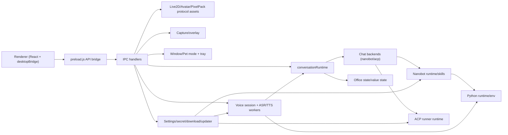

# Free-Agent-Vtuber-Openclaw 功能集结构与契约报告

## 1. 探索任务分配（subagent-style）

| 探索单元 | 功能集 | 主要范围 |
|---|---|---|
| S1 | 会话编排与聊天后端 | `desktop/electron/services/chat/**`, `ipc/chatStream.js`, `ipc/conversation.js`, `services/persona/**`, `services/valueState/**` |
| S2 | 语音会话与 ASR/TTS | `ipc/voiceSession.js`, `ipc/voiceModels.js`, `services/voice/**`, `front_end/src/hooks/voice/**` |
| S3 | 共享 Python runtime/env | `services/python/**`, `services/voice/voiceModelLibrary.js`, `services/chat/nanobot/nanobotRuntimeManager.js` |
| S4 | Nanobot 运行时与技能 | `ipc/nanobotRuntime.js`, `ipc/nanobotSkills.js`, `services/chat/nanobot/**`, `backends/nanobotBackend.js` |
| S5 | ACP Runner 与外部代理后端 | `ipc/acpRunnerRuntime.js`, `services/chat/acp/**`, `backends/acpBackend.js`, `backends/claudeCodeBackend.js`, `backends/codexBackend.js` |
| S6 | Live2D/静态头像/像素包资源 | `services/live2dModelLibrary.js`, `services/staticAvatarLibrary.js`, `services/pixelPackLibrary.js`, 对应 IPC |
| S7 | Office/Pixel Room 状态系统 | `services/officeStateStore.js`, `services/officePresenceProducer.js`, `ipc/officeState.js`, `ipc/valueState.js`, `front_end/src/components/office/**` |
| S8 | 截图与权限闭环 | `ipc/screenshotCapture.js`, `services/screenshotCaptureService.js`, `services/screenshotSelectionService.js`, `front_end/src/screenshot-overlay-main.jsx` |
| S9 | Window/Pet 模式与托盘 | `window/modeIpc.js`, `window/windowModeManager.js`, `window/trayManager.js`, `front_end/src/mode/**`, `front_end/src/hooks/pet/**` |
| S10 | 设置/密钥/下载任务/更新器 | `ipc/settings.js`, `services/settingsStore.js`, `services/secretStore.js`, `services/download/**`, `services/appUpdaterService.js` |

## 2. 全局关系图

## 3. 功能集逐项报告

## 3.1 会话编排与聊天后端（S1）

### 组成模块
- 主进程编排：`desktop/electron/services/chat/conversationRuntime.js`
- 后端选择：`desktop/electron/services/chat/backendManager.js`
- 聊天流 IPC：`desktop/electron/ipc/chatStream.js`
- 会话控制 IPC：`desktop/electron/ipc/conversation.js`
- 人设与短时记忆：`desktop/electron/services/persona/*`
- 数值状态：`desktop/electron/services/valueState/*`, `desktop/electron/ipc/valueState.js`
- 渲染层消费：`front_end/src/hooks/useStreamingChat.js`, `front_end/src/components/chat/*`

### 与其他功能集联系
- 上游依赖：设置系统（backend 选择与参数）、Nanobot/ACP 后端。
- 下游输出：`conversation:event` 统一事件流被聊天 UI、字幕、Office 状态、Value 状态消费。
- 横向联动：语音 ASR final 会反向触发 `conversationRuntime.submitUserText(...)`。

### 协议/契约
- 并发策略契约：`latest-wins | queue`，默认 `latest-wins`。
- 路由键契约：`routeKey = agentId:backend:sessionNamespace`。
- IPC 契约：
  - `conversation:submit-user-text`
  - `conversation:abort-active`
  - `conversation:permission:resolve`
  - `chat:stream:start`
  - `chat:stream:abort`
- 事件 envelope 契约（核心）：`conversation:event`，字段包含 `channel/type/streamId/agentId/backend/routeKey/sessionId/payload`。
- 聊天事件类型契约：`stream-start | text-delta | segment-ready | done | error | permission-request | agent-state`。

## 3.2 语音会话与 ASR/TTS（S2）

### 组成模块
- 语音 IPC：`desktop/electron/ipc/voiceSession.js`
- 模型管理 IPC：`desktop/electron/ipc/voiceModels.js`
- 服务层：`desktop/electron/services/voice/asrService.js`, `ttsService.js`, `voiceModelLibrary.js`
- Worker：`asrWorkerClient.js`, `asrWorkerProcess.js`, `ttsWorkerClient.js`, `ttsWorkerProcess.js`
- 渲染层：`front_end/src/hooks/voice/*`, `front_end/src/components/config/VoiceSettingsPanel.jsx`

### 与其他功能集联系
- 强依赖 Python runtime/env 功能集（python provider 与模型安装）。
- 与会话编排联动：ASR final 自动转聊天输入。
- 与下载任务中心联动：模型安装/下载进度统一进 `download-task:progress`。

### 协议/契约
- IPC 契约：
  - `voice:session:start`
  - `voice:audio:chunk`
  - `voice:input:commit`
  - `voice:session:stop`
  - `voice:tts:stop`
  - `voice:playback:ack`
  - `voice:warmup`
  - `voice:diagnostics:asr`, `voice:diagnostics:tts`
- 事件契约：语音事件经 `conversation:event` 的 `channel=voice` 传递。
- Flow-control 契约：`voice:flow-control`，典型载荷 `{ type: 'tts-flow-control', action: 'pause'|'resume', bufferedMs }`。
- Backpressure 契约：TTS 通过 ACK (`voice:playback:ack`) 驱动节流恢复。

## 3.3 共享 Python runtime/env（S3）

### 组成模块
- 运行时目录与包目录：`desktop/electron/services/python/pythonRuntimeCatalog.js`
- 运行时安装管理：`desktop/electron/services/python/pythonRuntimeManager.js`
- 虚拟环境管理：`desktop/electron/services/python/pythonEnvManager.js`
- 消费方注入：`desktop/electron/services/voice/voiceModelLibrary.js`、`desktop/electron/services/chat/nanobot/nanobotRuntimeManager.js`

### 生命周期流程
1. 解析平台包（默认 Python `3.12.12`）。
2. 下载并解压到 `userData/python-runtime/python`。
3. `pythonEnvManager.ensureEnv(...)` 创建 `userData/python-envs/<envId>`。
4. 按 profile/pipPackages 安装依赖并写 `manifest.json`。
5. 语音/Nanobot 通过 `pythonEnvId` 反查 `envPythonExecutable` 注入运行环境。

### 与其他功能集耦合
- 被语音模型安装与运行依赖。
- 被 Nanobot runtime 安装与启动依赖。
- 下载阶段进度被上层任务中心消费。

### 协议/契约
- `pythonEnvId` 契约：作为长期引用主键，替代“模型包内绑定 Python”旧路径。
- 锁契约：`envId` 由 `profile + pythonVersion + platform + pipPackages(lockHash)`稳定派生。
- 目录契约：
  - `python-runtime/`
  - `python-envs/<env-id>/`
- 错误码契约：`python_runtime_*`、`python_env_*` 前缀用于上层映射与展示。

## 3.4 Nanobot 运行时与技能（S4）

### 组成模块
- IPC：`desktop/electron/ipc/nanobotRuntime.js`, `desktop/electron/ipc/nanobotSkills.js`
- Runtime 安装与启动配置：`desktop/electron/services/chat/nanobot/nanobotRuntimeManager.js`
- Bridge 客户端：`desktop/electron/services/chat/nanobot/nanobotBridgeClient.js`
- Chat 适配：`desktop/electron/services/chat/backends/nanobotBackend.js`
- 技能库：`desktop/electron/services/chat/nanobot/nanobotSkillsLibrary.js`

### 与其他功能集联系
- 强依赖 Python runtime/env。
- 作为聊天后端之一挂到 conversationRuntime。
- 技能导入/删除走 settings/download/UI 配置面板。

### 协议/契约
- IPC：`nanobot-runtime:status/install`、`nanobot-skills:list/import-zip/delete/open-library`。
- 启动契约：`resolveLaunchConfig() -> { pythonBin, nanobotRepoPath }`。
- 配置契约：`settings.nanobot` 至少满足 `enabled + provider + model + apiKey` 才可运行。

## 3.5 ACP Runner 与外部代理后端（S5）

### 组成模块
- Runner 安装管理：`desktop/electron/services/chat/acp/acpRunnerRuntimeManager.js`
- Runner IPC：`desktop/electron/ipc/acpRunnerRuntime.js`
- ACP transport 抽象：`desktop/electron/services/chat/acp/acpTransportClient.js`
- 事件映射与设置归一化：`desktop/electron/services/chat/acp/acpEventMapper.js`
- 后端适配：`acpBackend.js`, `claudeCodeBackend.js`, `codexBackend.js`

### 与其他功能集联系
- 被聊天 backend manager 选路。
- 安装后回写 settings 中 runner.command。
- 下载进度进入统一下载中心显示。

### 协议/契约
- Runner IPC：`acp-runner:status`, `acp-runner:install`, 以及 `acp-runner:progress`。
- 设置契约：
  - `enabled`
  - `timeoutMs`
  - `askTimeoutMs`
  - `permissionMode`
  - `runner{ protocol, transport, command, args, cwd, endpoint, url, permissionEndpoint, headers, env }`
- 传输契约：`stdio | http | websocket`。

## 3.6 Live2D / 静态头像 / Pixel Pack 资源系统（S6）

### 组成模块
- 主进程库：
  - `desktop/electron/services/live2dModelLibrary.js`
  - `desktop/electron/services/staticAvatarLibrary.js`
  - `desktop/electron/services/pixelPackLibrary.js`
- IPC：
  - `live2d-models:*`
  - `static-avatars:*`
  - `pixel-packs:*`
- 渲染层：
  - `front_end/src/components/live2d/*`
  - `front_end/src/components/avatar/*`
  - `front_end/src/components/office/pixelPack.js`

### 与其他功能集联系
- Office 场景资源可由 Pixel Pack 覆盖。
- 模式切换（Window/Pet/Immersive）共享 AvatarRenderer。
- 设置系统保存 UI avatar 与 pixel pack 状态。

### 协议/契约
- 自定义协议：
  - `openclaw-model://`
  - `openclaw-avatar://`
  - `openclaw-pixel-pack://`
- 协议注册：主进程通过 `protocol.handle(...)` 提供只读资源流。
- 安全契约：三套库均做 root confinement + traversal 拒绝。
- Manifest 契约：
  - Static Avatar: `schemaVersion`, `packId`, `states(idle/writing/researching/executing/error)`
  - Pixel Pack: `manifest.json` + `schemaVersion=1` + `assets`/`contractRevision`

## 3.7 Office / Pixel Room 状态系统（S7）

### 组成模块
- Store：`desktop/electron/services/officeStateStore.js`
- Presence：`desktop/electron/services/officePresenceProducer.js`
- IPC：`desktop/electron/ipc/officeState.js`, `desktop/electron/ipc/valueState.js`
- 渲染：`front_end/src/components/office/*`, `front_end/src/shells/RoomStudioShell.jsx`

### 与其他功能集联系
- 聊天系统把 `chat/system` 事件映射成 office execution-fact / scene-intent。
- Value 状态与沉浸式壳层展示（mood/affinity）联动。
- Pixel Pack 影响场景资源解析。

### 协议/契约
- Office IPC：`office-state:get/upsert/update/presence/heartbeat/remove/set-active`。
- Value IPC：`value-state:get/upsert/propose/update/apply-interaction`。
- 状态 shape 契约：`{ revision, activeAgentId, agents[] }`，并支持 `intentState/factState` 分层。
- 业务状态契约：`idle/writing/researching/executing/syncing/error` 等。

## 3.8 截图与权限闭环（S8）

### 组成模块
- IPC：`desktop/electron/ipc/screenshotCapture.js`
- 截图缓存：`desktop/electron/services/screenshotCaptureService.js`
- 选区 overlay：`desktop/electron/services/screenshotSelectionService.js`
- 渲染：
  - `front_end/src/hooks/chat/useScreenCaptureController.js`
  - `front_end/src/screenshot-overlay-main.jsx`
  - `front_end/src/components/chat/ScreenCaptureOverlay.jsx`
  - `front_end/src/components/chat/PermissionRequestDialog.jsx`

### 与其他功能集联系
- 与聊天输入链路联动（截图草稿作为消息附件上下文）。
- 与会话权限 `permission-request -> conversation:permission:resolve` 闭环联动。

### 协议/契约
- Capture IPC：`capture:window:begin/finish/save/release/select-region`。
- Overlay IPC：`capture-overlay:get-session/confirm/cancel`。
- 约束契约：
  - 截图最大 `5MB`
  - 缓存 TTL `30min`
  - 选区最小尺寸校验（宽高 >= 2）

## 3.9 Window/Pet 模式与托盘（S9）

### 组成模块
- 主进程：
  - `desktop/electron/window/windowModeManager.js`
  - `desktop/electron/window/modeIpc.js`
  - `desktop/electron/window/trayManager.js`
- 渲染：
  - `front_end/src/mode/ModeContext.jsx`
  - `front_end/src/mode/useModeHandshake.js`
  - `front_end/src/hooks/pet/*`
  - `front_end/src/shells/MainShell.jsx`, `PetShell.jsx`

### 与其他功能集联系
- 决定 UI 壳层（PetShell/MainShell/Office/Immersive）行为与交互穿透。
- 与聊天/语音/头像渲染共同构成桌宠体验。

### 协议/契约
- IPC：
  - `pet:get-mode`
  - `pet:set-mode`
  - `pet:renderer-ready`
  - `pet:mode-rendered`
  - `pet:update-hover`
  - `pet:toggle-force-ignore-mouse`
- 事件契约：`pet:pre-mode-changed`, `pet:mode-changed`, `pet:force-ignore-mouse-changed`。
- 握手契约：渲染层双帧后回调 `notifyRendererReady/notifyModeRendered`，避免切换闪烁。

## 3.10 设置/密钥/下载任务/更新器（S10）

### 组成模块
- 设置与密钥：
  - `desktop/electron/ipc/settings.js`
  - `desktop/electron/services/settingsStore.js`
  - `desktop/electron/services/secretStore.js`
- 下载任务中心：
  - `desktop/electron/services/download/downloadInstallTaskManager.js`
  - `desktop/electron/ipc/voiceModels.js`（透传 task 进度）
- 更新器：
  - `desktop/electron/services/appUpdaterService.js`
  - `desktop/electron/ipc/appUpdater.js`
- 渲染：
  - `front_end/src/services/desktopBridge.js`
  - `front_end/src/hooks/download/useUnifiedDownloader.js`
  - `front_end/src/components/download/UnifiedDownloadDialog.jsx`
  - `front_end/src/components/config/ConfigDrawer.jsx`

### 与其他功能集联系
- 所有后端与运行时功能集的配置入口都在 settings shape 里。
- Nanobot/ACP/Voice 的安装与下载进度统一汇入下载中心。
- 更新器是独立支撑，但状态也经同一桥接层进入配置 UI。

### 协议/契约
- Settings IPC：`settings:get/save/test`、`settings:nanobot:pick-workspace/open-workspace`。
- App updater IPC：`app-updater:get-state/check/download/install` + `app-updater:state` 推送。
- 下载任务契约：
  - `download-task:progress` 推送
  - `download-task:list`
  - `download-task:cancel`
- Secret 契约：keytar service `otakuclaw-desktop`，账户键如 `openclaw-token`/`nanobot-api-key`/`dashscope-api-key`。

## 4. 关键契约索引（跨功能集）

| 类别 | 契约 |
|---|---|
| 统一会话事件 | `conversation:event`（`channel=chat/voice/system/office`） |
| 语音流控 | `voice:flow-control` + `voice:playback:ack` |
| 模型/运行时下载 | `voice-models:download-progress`, `nanobot-runtime:progress`, `acp-runner:progress`, `download-task:progress` |
| 资源协议 | `openclaw-model://`, `openclaw-avatar://`, `openclaw-pixel-pack://` |
| 模式切换握手 | `pet:*` IPC + pre-change/rendered 事件 |
| 配置主形状 | `chatBackend + openclaw + nanobot + claudeCode + codex + voice + ui` |

## 5. 设计边界与注意点

1. `conversation:event` 是跨聊天/语音/Office 的主总线，新增事件类型应先保证 envelope 稳定性。
2. Python runtime 已切到“共享 runtime + profile env + pythonEnvId 引用”模式，避免回退到“模型包内 Python”路径。
3. 自定义资源协议与 ZIP 导入都在主进程做路径约束校验，渲染层不应绕过该边界直接访问本地文件系统。

