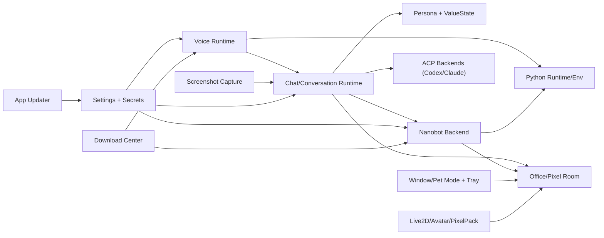

# Free-Agent-Vtuber-Openclaw 功能集模块关系与契约报告

## 1. 说明与产出来源

本报告基于多 subagent 并行探索结果汇总（ACP 编排三轮，覆盖 10 个功能集），并由主线程统一归并。

- 第一轮（codex runner）完成：聊天会话、Python 运行时、ACP runners、截图、窗口模式
- 第二轮（claude runner）完成：Nanobot、Live2D/StaticAvatar/PixelPack、Office/ValueState、设置/下载/更新
- 第三轮（copilot runner）完成：Voice 运行时

所有探索均为只读，不改代码。

### 1.1 subagent 分配记录

| 功能集 | subagent 任务ID | runner |
|---|---|---|
| 聊天与会话编排 | `fs-chat-conversation` | `codex` |
| 语音运行时 | `fs-voice-runtime-r3` | `copilot` |
| 共享 Python 运行时/环境 | `fs-python-runtime` | `codex` |
| Nanobot runtime 与 skills | `fs-nanobot-runtime-r2` | `claude` |
| ACP runners 与多代理后端 | `fs-acp-runners` | `codex` |
| Live2D + Static Avatar + PixelPack | `fs-live2d-avatar-assets-r2` | `claude` |
| Office/Pixel Room + ValueState | `fs-office-value-room-r2` | `claude` |
| 截图捕获与选区覆盖层 | `fs-screenshot-capture` | `codex` |
| 窗口/宠物模式与托盘 | `fs-window-mode-shell` | `codex` |
| 设置 + 下载中心 + 应用更新 | `fs-settings-download-updater-r2` | `claude` |

---

## 2. 功能集总览

| 功能集 | 核心职责 | 核心模块（关键文件） |
|---|---|---|
| 聊天与会话编排 | 把一次用户输入编排为可中断/可路由/可观测的 turn | `ipc/chatStream.js`, `ipc/conversation.js`, `services/chat/**`, `services/persona/**`, `services/valueState/**`, `hooks/useStreamingChat.js` |
| 语音运行时 | 录音->ASR->聊天提交->TTS 分段播放与背压流控 | `ipc/voiceSession.js`, `ipc/voiceModels.js`, `services/voice/**`, `hooks/voice/**`, `VoiceSettingsPanel.jsx` |
| 共享 Python 运行时/环境 | 统一 Python runtime 与隔离 env，供 Voice/Nanobot 复用 | `services/python/**`, `services/voice/voiceModelLibrary.js`, `services/chat/nanobot/nanobotRuntimeManager.js` |
| Nanobot runtime 与 skills | Nanobot 后端安装/启动、bridge 通信、skills 库管理 | `ipc/nanobotRuntime.js`, `ipc/nanobotSkills.js`, `services/chat/nanobot/**`, `services/chat/backends/nanobotBackend.js` |
| ACP runners 与多代理后端 | 管理 codex/claude runner 安装与接入，建立 ask 权限闭环 | `ipc/acpRunnerRuntime.js`, `services/chat/acp/**`, `services/chat/backends/acpBackend.js` |
| Live2D + Static Avatar + PixelPack | 资产导入、协议访问、渲染消费、路径安全 | `ipc/live2dModels.js`, `ipc/staticAvatars.js`, `ipc/pixelPacks.js`, `services/live2dModelLibrary.js`, `services/staticAvatarLibrary.js`, `services/pixelPackLibrary.js` |
| Office/Pixel Room + ValueState | 多 Agent 办公态展示与数值状态规则引擎 | `ipc/officeState.js`, `ipc/valueState.js`, `services/officeStateStore.js`, `services/officePresenceProducer.js`, `services/valueState/**`, `components/office/**` |
| 截图捕获与选区覆盖层 | 区域截图、overlay 生命周期、附件回传 | `ipc/screenshotCapture.js`, `services/screenshotCaptureService.js`, `services/screenshotSelectionService.js`, `hooks/chat/useScreenCaptureController.js` |
| 窗口/宠物模式与托盘 | window/pet 模式握手、鼠标穿透、托盘驱动切换 | `window/modeIpc.js`, `window/windowModeManager.js`, `window/trayManager.js`, `mode/**`, `hooks/pet/**` |
| 设置 + 下载中心 + 应用更新 | 配置落盘、密钥托管、任务下载、auto-updater 状态机 | `ipc/settings.js`, `ipc/appUpdater.js`, `services/settingsStore.js`, `services/secretStore.js`, `services/download/**`, `services/appUpdaterService.js` |

---

## 3. 功能集详细结构

## 3.1 聊天与会话编排

- 模块组成
  - 主进程：`desktop/electron/ipc/chatStream.js`, `desktop/electron/ipc/conversation.js`, `desktop/electron/services/chat/**`
  - 侧向能力：`desktop/electron/services/persona/**`, `desktop/electron/services/valueState/**`
  - 渲染：`front_end/src/hooks/useStreamingChat.js`, `front_end/src/hooks/chat/**`, `front_end/src/components/chat/**`, `front_end/src/services/desktopBridge.js`
- 与其他功能集联系
  - 语音 ASR final 会回流到 `conversation.submitUserText(source=voice-asr)`
  - Nanobot/ACP 的 tool-hint 会映射到 office activity
  - persona/valueState 在 turn 前后注入与回写
  - 截图附件会作为消息 media 输入 nanobot backend
- 协议/契约
  - 请求 IPC：`conversation:submit-user-text`, `conversation:abort-active`, `conversation:permission:resolve`
  - 统一事件：`conversation:event` envelope
  - chat 常见 type：`stream-start`, `text-delta`, `segment-ready`, `permission-request`, `done`, `error`
  - 并发策略契约：`latest-wins` / `queue`

## 3.2 语音运行时

- 模块组成
  - 主进程：`desktop/electron/ipc/voiceSession.js`, `desktop/electron/ipc/voiceModels.js`, `desktop/electron/services/voice/**`
  - 渲染：`front_end/src/hooks/voice/**`, `front_end/src/components/config/VoiceSettingsPanel.jsx`, `front_end/src/services/desktopBridge.js`
- 与其他功能集联系
  - ASR 结果进入聊天功能集
  - segment-ready/done/error 与字幕桥、TTS 播放链路联动
  - 依赖 Python runtime/env 与下载任务系统
- 协议/契约
  - 会话 IPC：`voice:session:start`, `voice:audio:chunk`, `voice:input:commit`, `voice:session:stop`
  - 播放/流控 IPC：`voice:playback:ack`, `voice:tts:stop`, 事件 `voice:flow-control`
  - 事件出口：`conversation:event`（`channel='voice'`）
  - 模型 IPC：`voice-models:*` + `download-task:*`

## 3.3 共享 Python 运行时/环境

- 模块组成
  - `desktop/electron/services/python/pythonRuntimeCatalog.js`
  - `desktop/electron/services/python/pythonRuntimeManager.js`
  - `desktop/electron/services/python/pythonEnvManager.js`
- 与其他功能集联系
  - Voice 安装 Python 模型时调用 `ensureRuntime/ensureEnv`
  - Nanobot runtime 安装与启动配置复用同一套 runtime/env
- 协议/契约
  - 运行时对象：`pythonVersion/platformKey/archiveUrl`
  - env 契约：`profile`, `pipPackages`, `pythonEnvId`, `envPythonExecutable`
  - 路径根：`$userData/python-runtime`, `$userData/python-envs`

## 3.4 Nanobot runtime 与 skills

- 模块组成
  - IPC：`desktop/electron/ipc/nanobotRuntime.js`, `desktop/electron/ipc/nanobotSkills.js`
  - 服务：`desktop/electron/services/chat/nanobot/nanobotRuntimeManager.js`, `nanobotBridgeClient.js`, `nanobotSkillsLibrary.js`, `nanobot_bridge.py`
  - 后端接入：`desktop/electron/services/chat/backends/nanobotBackend.js`
  - 渲染配置入口：`front_end/src/components/config/ConfigDrawer.jsx`, `front_end/src/constants/nanobotProviders.js`
- 与其他功能集联系
  - 依赖 Python runtime/env
  - tool-hint 映射 Office activity
  - 与截图附件读取链路联动
- 协议/契约
  - runtime IPC：`nanobot-runtime:status`, `nanobot-runtime:install`
  - skills IPC：`nanobot-skills:list/import-zip/delete/open-library`
  - bridge 协议：JSON-Lines 事件流（progress/text-delta/tool-hint/done/error）

## 3.5 ACP runners 与多代理后端

- 模块组成
  - IPC：`desktop/electron/ipc/acpRunnerRuntime.js`
  - 服务：`desktop/electron/services/chat/acp/**`
  - 后端：`desktop/electron/services/chat/backends/acpBackend.js`, `claudeCodeBackend.js`, `codexBackend.js`
  - 主流程接入：`desktop/electron/main.js` 中 `applyManagedAcpRunnerCommands`
- 与其他功能集联系
  - 与聊天会话编排共享 `conversation:event`
  - 权限 ask 与渲染 `PermissionRequestDialog` 闭环交互
- 协议/契约
  - runner IPC：`acp-runner:status`, `acp-runner:install`, `acp-runner:progress`
  - transport：`stdio/http/websocket`
  - 事件映射：ACP 事件 -> chat event envelope

## 3.6 Live2D + Static Avatar + PixelPack

- 模块组成
  - IPC：`desktop/electron/ipc/live2dModels.js`, `staticAvatars.js`, `pixelPacks.js`
  - 服务：`desktop/electron/services/live2dModelLibrary.js`, `staticAvatarLibrary.js`, `pixelPackLibrary.js`
  - 渲染：`front_end/src/components/live2d/**`, `avatar/**`, `office/pixelPack.js`
- 与其他功能集联系
  - PixelPack 为 Office 场景资产层
  - Avatar 渲染模式与主 shell/配置共存
- 协议/契约
  - 自定义协议：`openclaw-model://`, `openclaw-avatar://`, `openclaw-pixel-pack://`
  - 三套协议均做路径 confinement 与 traversal 拒绝
  - ZIP/manifest 校验确保资产完整性

## 3.7 Office/Pixel Room + ValueState

- 模块组成
  - 主进程：`desktop/electron/ipc/officeState.js`, `ipc/valueState.js`, `services/officeStateStore.js`, `services/officePresenceProducer.js`, `services/valueState/**`
  - 渲染：`front_end/src/components/office/**`, `front_end/src/shells/RoomStudioShell.jsx`, `front_end/src/App.jsx`
- 与其他功能集联系
  - 聊天/Nanobot tool-hint -> `researching/executing/writing` 状态映射
  - ValueState 作为独立数值层，为未来 mood 驱动视觉预留
- 协议/契约
  - office IPC：`office-state:get/upsert/update/presence/heartbeat/remove/set-active`
  - value IPC：`value-state:*`
  - 状态结构：`{ revision, activeAgentId, agents[] }`，含 `intentState/factState` 分层

## 3.8 截图捕获与选区覆盖层

- 模块组成
  - IPC：`desktop/electron/ipc/screenshotCapture.js`
  - 服务：`desktop/electron/services/screenshotCaptureService.js`, `screenshotSelectionService.js`
  - 渲染：`front_end/src/hooks/chat/useScreenCaptureController.js`, `front_end/src/screenshot-overlay-main.jsx`
- 与其他功能集联系
  - 截图结果作为聊天附件进入提交链路
  - 与 ACP 权限弹窗是两套不同机制（系统屏幕权限 vs agent ask）
- 协议/契约
  - IPC：`capture:*`, `capture-overlay:*`
  - 结果契约：`captureId`, `previewUrl` 等
  - 权限错误契约：`capture_permission_denied` 等 reason code

## 3.9 窗口/宠物模式与托盘

- 模块组成
  - 主进程：`desktop/electron/window/modeIpc.js`, `windowModeManager.js`, `trayManager.js`
  - 渲染：`front_end/src/mode/**`, `front_end/src/hooks/pet/**`, `front_end/src/shells/MainShell.jsx`, `PetShell.jsx`
- 与其他功能集联系
  - 作为壳层能力，承载聊天/语音/office UI 的展示模式
- 协议/契约
  - 握手事件：`pet:pre-mode-changed` -> `pet:renderer-ready` -> `pet:mode-changed` -> `pet:mode-rendered`
  - 鼠标穿透契约：hover 区域与 `forceIgnoreMouse` 联动

## 3.10 设置 + 下载中心 + 应用更新

- 模块组成
  - 设置/密钥：`desktop/electron/ipc/settings.js`, `services/settingsStore.js`, `services/secretStore.js`
  - 下载：`desktop/electron/services/download/**`, `services/shared/resumableDownloader.js`
  - 更新：`desktop/electron/ipc/appUpdater.js`, `services/appUpdaterService.js`
  - 渲染：`front_end/src/components/config/ConfigDrawer.jsx`, `components/download/UnifiedDownloadDialog.jsx`, `hooks/download/useUnifiedDownloader.js`
- 与其他功能集联系
  - Voice/Nanobot 安装进度统一进入下载中心
  - 所有后端设置与 API key 由 settingsStore/secretStore 托管
- 协议/契约
  - settings IPC：`settings:get/save/test`, `settings:nanobot:pick-workspace` 等
  - app-updater IPC：`app-updater:get-state/check/download/install`
  - 下载任务契约：`download-task:list/cancel` + progress payload（速度、ETA、phase）

---

## 4. 关键跨功能联系图

---

## 5. 全局契约清单（高频）

- 统一会话事件总线：`conversation:event`
  - envelope 关键字段：`channel`, `type`, `streamId`, `turnId`, `sessionId`, `agentId`, `backend`, `routeKey`, `payload`
- 语音流控：`voice:flow-control`
  - `payload = { type:'tts-flow-control', action:'pause'|'resume', ... }`
- 截图链路：`capture:*` / `capture-overlay:*`
- 资产协议：`openclaw-model://`, `openclaw-avatar://`, `openclaw-pixel-pack://`
- 设置密钥边界：敏感字段留在主进程 + keychain（renderer 仅看到脱敏值）
- 下载状态语义
  - 任务状态：`pending/running/recovering/completed/failed/canceled`
  - 阶段状态：`started/running/extracting/installing/completed/failed`

---

## 6. 结构性观察（架构层）

- 以 `conversation:event` 为主干的“单总线”做得比较彻底，chat/voice/office/value 能在同一 envelope 体系下扩展。
- Python runtime/env 被 Voice 与 Nanobot 复用，避免重复安装，方向正确。
- 资产服务（Live2D/Avatar/PixelPack）在路径安全上做了统一 root confinement，是明确的安全边界。
- 目前较重模块是 `settingsStore.js`（逻辑聚合度高），后续可考虑按域拆分（backend settings / voice settings / migration / secrets facade）。
