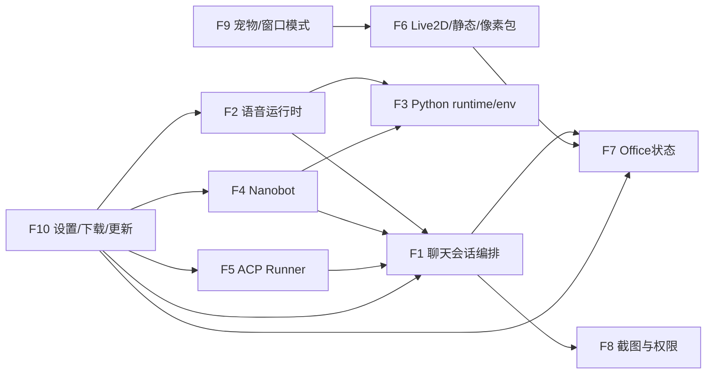

# Free-Agent-Vtuber-Openclaw 功能集模块组成、联系与契约报告

## 0. 执行说明（subagent 分派结果）

本次按照你的要求进行了“每个功能集一个 subagent”探索，执行路径如下：

- 子代理通道 A：ACP 编排器（`codex-acp`）
  - 已成功：`acp-runners`、`avatar-assets`、`capture-permission`
  - 失败原因：`usage_limit_exceeded`（配额上限）
- 子代理通道 B：本机 `claude -p` 子代理批处理
  - 已成功：`chat-conversation`、`voice-runtime`、`python-runtime`、`nanobot`、`acp-runners`、`avatar-assets`
  - 失败原因：`You've hit your limit · resets 2am`（配额上限）
- 主线程补全（本地代码直读）
  - `office-scene`、`capture-permission`、`window-mode`、`settings-download-update`

最终这份报告覆盖 10 个功能集，信息来源为“可用子代理产物 + 主线程代码核验/补全”。

---

## 1. 功能集总览

| 功能集 ID | 功能集名称 | 核心定位 |
|---|---|---|
| F1 | 聊天与会话编排 | 聊天 turn 生命周期、后端路由、流式事件总线 |
| F2 | 语音运行时 | ASR/TTS 会话、音频流、背压控制 |
| F3 | 共享 Python 运行时与隔离 env | 统一 Python runtime 与多 profile env 管理 |
| F4 | Nanobot 集成 | Nanobot runtime/bridge/skills/后端适配 |
| F5 | ACP Runner 与外部代理后端 | Codex/Claude ACP runner 安装与传输抽象 |
| F6 | Live2D/静态头像/像素包资源 | 虚拟形象与 Pixel Room 资源生命周期 |
| F7 | Office/Pixel Room 状态与场景 | 办公室状态存储、presence、渲染映射 |
| F8 | 截图捕获与权限闭环 | 屏幕选区、截图保存、会话附件、权限决策 |
| F9 | 窗口模式/宠物模式/托盘 | pet/window 切换握手与鼠标穿透控制 |
| F10 | 设置/安全存储/下载中心/更新 | 配置持久化、密钥托管、下载任务、自动更新 |

---

## 2. 功能集详细拆解

## F1 聊天与会话编排

### 组成模块
- 主进程
  - `desktop/electron/ipc/chatStream.js`
  - `desktop/electron/ipc/conversation.js`
  - `desktop/electron/services/chat/conversationRuntime.js`
  - `desktop/electron/services/chat/backendManager.js`
  - `desktop/electron/services/chat/backends/*.js`
  - `desktop/electron/services/chat/segmenter.js`
  - `desktop/electron/services/persona/*`
  - `desktop/electron/services/valueState/*`
- 预加载
  - `desktop/electron/preload.js`（`conversation` 桥）
- 渲染层
  - `front_end/src/services/desktopBridge.js`（`chat`/`conversation`）
  - `front_end/src/hooks/useStreamingChat.js`
  - `front_end/src/hooks/chat/*`
  - `front_end/src/components/chat/*`

### 与其他功能集联系
- 与 F2（语音）：`asr-final` 可触发 chat 自动提交；共用 `conversation:event` 信封。
- 与 F7（Office）：聊天事件里的 tool-hint/agent-state 驱动 office business state。
- 与 F8（截图）：截图 `captureId` 作为聊天附件输入。
- 与 F10（设置）：读取 `chatBackend` / backend 配置并在 `settings:test` 中验证连接。

### 协议/契约
- IPC
  - `conversation:submit-user-text`
  - `conversation:abort-active`
  - `conversation:permission:resolve`
  - 兼容层：`chat:stream:start` / `chat:stream:abort`
- 事件信封
  - `conversation:event`，`channel: 'chat'|'voice'|...`
  - 常见 `type`: `text-delta` / `segment-ready` / `permission-request` / `done` / `error`
- 并发契约
  - routeKey 粒度策略：`latest-wins` 或 `queue`

---

## F2 语音运行时

### 组成模块
- 主进程
  - `desktop/electron/ipc/voiceSession.js`
  - `desktop/electron/ipc/voiceModels.js`
  - `desktop/electron/services/voice/*`
  - `desktop/electron/services/voice/providers/*`
  - `desktop/electron/services/voice/providers/python/*`
- 渲染层
  - `front_end/src/hooks/voice/*`
  - `front_end/src/components/config/VoiceSettingsPanel.jsx`
  - `front_end/src/services/desktopBridge.js`（`voice`）

### 与其他功能集联系
- 与 F1（聊天）：`asr-final` -> 可触发聊天提交；聊天分段回流至 TTS 播放。
- 与 F3（Python）：python provider 依赖共享 runtime 与 env。
- 与 F10（下载）：语音模型下载和安装进度接入统一下载 UI。

### 协议/契约
- IPC：`voice:session:start`、`voice:audio:chunk`、`voice:input:commit`、`voice:session:stop`、`voice:playback:ack` 等。
- 事件：`conversation:event` + `channel='voice'`，`type` 包括 `asr-partial` / `asr-final` / `tts-chunk` / `done` / `error`。
- 背压：`voice:flow-control`，`{ type:'tts-flow-control', action:'pause'|'resume' }`。

---

## F3 共享 Python 运行时与隔离 env

### 组成模块
- `desktop/electron/services/python/pythonRuntimeManager.js`
- `desktop/electron/services/python/pythonEnvManager.js`
- `desktop/electron/services/python/pythonRuntimeCatalog.js`
- 消费者侧
  - `desktop/electron/services/voice/voiceModelLibrary.js`
  - `desktop/electron/services/chat/nanobot/nanobotRuntimeManager.js`

### 与其他功能集联系
- 服务 F2（语音）与 F4（Nanobot），通过 `pythonEnvId` 解耦不同依赖集合。
- 受 F10 下载链路间接影响（安装阶段 progress 与任务中心联动）。

### 协议/契约
- env 命名：`{profile}-py{ver}-{lockHash}`
- 元数据：`python-envs/<envId>/manifest.json`
- 关键字段：`pythonEnvId`、`envPythonExecutable`
- 默认 runtime：Python `3.12.12`

---

## F4 Nanobot 集成

### 组成模块
- 主进程
  - `desktop/electron/ipc/nanobotRuntime.js`
  - `desktop/electron/ipc/nanobotSkills.js`
  - `desktop/electron/services/chat/nanobot/*`
  - `desktop/electron/services/chat/backends/nanobotBackend.js`
- 渲染层
  - `front_end/src/constants/nanobotProviders.js`
  - `front_end/src/components/config/ConfigDrawer.jsx`（nanobot 配置与安装入口）

### 与其他功能集联系
- 依赖 F3（共享 Python）做 runtime/env 安装。
- 通过 F1 作为后端实现参与会话编排。
- 将工具调用语义映射给 F7（office 状态）。
- 安装/下载进度接入 F10（下载中心）。

### 协议/契约
- IPC
  - `nanobot-runtime:status`
  - `nanobot-runtime:install`
  - `nanobot-skills:list/import-zip/delete/open-library`
- Bridge 协议（JSON lines）
  - 主进程 -> Python：`start` / `test` / `direct` / `abort`
  - Python -> 主进程：`ready` / `event` / `test-result` / `direct-result`
- 设置字段（`settings.nanobot`）
  - `enabled/workspace/provider/model/apiBase/maxTokens/temperature/reasoningEffort`

---

## F5 ACP Runner 与外部代理后端

### 组成模块
- 主进程
  - `desktop/electron/ipc/acpRunnerRuntime.js`
  - `desktop/electron/services/chat/acp/*`
  - `desktop/electron/services/chat/backends/acpBackend.js`
  - `desktop/electron/services/chat/backends/claudeCodeBackend.js`
  - `desktop/electron/services/chat/backends/codexBackend.js`
- 渲染层
  - `front_end/src/components/config/AgentRoleSettingsPanel.jsx`
  - `front_end/src/components/config/ConfigDrawer.jsx`（runner 配置）

### 与其他功能集联系
- 向 F1 提供 `claude-code`/`codex` 后端实现。
- 向 F10 暴露 runner 安装进度与设置写回。
- 与 F8 权限流程联动（`permission-request` ask/allow/deny）。

### 协议/契约
- IPC
  - `acp-runner:status`
  - `acp-runner:install`
- Transport 抽象
  - `stdio` / `http` / `websocket`
- 设置字段（`settings.claudeCode|codex.runner`）
  - `transport/command/args/cwd/endpoint/url/permissionEndpoint/headers/env`

---

## F6 Live2D / 静态头像 / 像素包资源

### 组成模块
- 主进程
  - `desktop/electron/ipc/live2dModels.js`
  - `desktop/electron/ipc/staticAvatars.js`
  - `desktop/electron/ipc/pixelPacks.js`
  - `desktop/electron/services/live2dModelLibrary.js`
  - `desktop/electron/services/staticAvatarLibrary.js`
  - `desktop/electron/services/pixelPackLibrary.js`
- 渲染层
  - `front_end/src/components/live2d/*`
  - `front_end/src/components/avatar/*`
  - `front_end/src/components/office/pixelPack.js`

### 与其他功能集联系
- F7（Office）通过像素包资产注册表驱动场景渲染。
- F2（语音）驱动 Live2D 唇形同步。
- F9（宠物模式）依赖命中检测和透明区域行为。

### 协议/契约
- 自定义协议
  - `openclaw-model://`
  - `openclaw-avatar://`
  - `openclaw-pixel-pack://`
- IPC
  - `live2d-models:list/import-zip`
  - `static-avatars:list/import-zip/remove`
  - `pixel-packs:list/validate/import-zip/activate/remove/export-zip/get-active-manifest`
- 安全契约
  - 协议路径根目录约束 + traversal 拒绝
  - 资源类型白名单

---

## F7 Office / Pixel Room 状态与场景（主线程补全）

### 组成模块
- 主进程
  - `desktop/electron/ipc/officeState.js`
  - `desktop/electron/services/officeStateStore.js`
  - `desktop/electron/services/officePresenceProducer.js`
  - `desktop/electron/ipc/valueState.js`
  - `desktop/electron/services/valueState/*`
  - `desktop/electron/main.js`（`office-state:changed` / `value-state:changed` 广播）
- 渲染层
  - `front_end/src/services/desktopBridge.js`（`office` / `valueState`）
  - `front_end/src/components/office/*`
  - `front_end/src/shells/RoomStudioShell.jsx`
  - `front_end/src/App.jsx`（office/value 订阅、presence 发布）

### 与其他功能集联系
- 从 F1 消费 `conversation:event`（tool/activity/system）并映射为场景状态。
- 从 F10 配置读取 `ui.officeSceneLayout` 与家具覆盖配置。
- 由 F6 提供资产（pixel pack / office assets）完成最终渲染。
- 与 F2/F4 通过 `businessState` 共享角色状态（如 `writing/researching/executing`）。

### 协议/契约
- IPC
  - `office-state:get|upsert|update|presence|heartbeat|remove|set-active`
  - `value-state:get|upsert|propose|update|apply-interaction`
- 主进程推送
  - `office-state:changed`（payload: `{ state, mutation }`）
  - `value-state:changed`（envelope + payload.state）
- 状态结构
  - office: `{ revision, activeAgentId, agents[] }`
  - value: `{ revision, agentId, routeKey, sessionId, stats, lastEvent }`
- presence lease
  - `ttlMs` 心跳续租，过期后清理 presence

---

## F8 截图捕获与权限闭环（主线程补全）

### 组成模块
- 主进程
  - `desktop/electron/ipc/screenshotCapture.js`
  - `desktop/electron/services/screenshotCaptureService.js`
  - `desktop/electron/services/screenshotSelectionService.js`
- 渲染层
  - `front_end/src/hooks/chat/useScreenCaptureController.js`
  - `front_end/src/components/chat/ScreenCaptureOverlay.jsx`
  - `front_end/src/screenshot-overlay-main.jsx`
  - `front_end/src/components/chat/PermissionRequestDialog.jsx`
  - `front_end/src/App.jsx`（permission queue 与 resolve）
  - `front_end/src/services/desktopBridge.js`（`capture` / `captureOverlay` / `conversation.resolvePermissionRequest`）

### 与其他功能集联系
- 与 F1：截图产物（`captureId`）作为聊天附件；会话中的 `permission-request` 用同一 UI 队列处理。
- 与 F9：截图选区期间会隐藏主窗口、弹 overlay，影响窗口可见/聚焦。
- 与 F10：错误与状态文案走统一 UI 反馈体系。

### 协议/契约
- 截图 IPC
  - `capture:window:begin|finish|save|release|select-region`
  - `capture-overlay:get-session|confirm|cancel`
- 截图对象契约
  - `saveCapture` 支持 `image/png|jpeg|webp`
  - 单图上限：`5MB`
  - 临时文件 TTL：`30min`
- 选区契约
  - 最小选区尺寸：`2x2`
  - 会话超时：`3min`
  - macOS 权限不足时返回 `capture_permission_denied`
- 权限请求契约（聊天侧）
  - `conversation:event` with `type='permission-request'`
  - 通过 `conversation:permission:resolve` 回传 `allow|deny`

---

## F9 窗口模式 / 宠物模式 / 托盘（主线程补全）

### 组成模块
- 主进程
  - `desktop/electron/window/modeIpc.js`
  - `desktop/electron/window/windowModeManager.js`
  - `desktop/electron/window/trayManager.js`
- 预加载
  - `desktop/electron/preload.js`（`windowMode` bridge）
- 渲染层
  - `front_end/src/mode/ModeContext.jsx`
  - `front_end/src/mode/useModeHandshake.js`
  - `front_end/src/shells/PetShell.jsx`
  - `front_end/src/hooks/pet/*`
  - `front_end/src/services/desktopBridge.js`（`mode`）

### 与其他功能集联系
- 与 F6（Live2D）：宠物模式下使用全桌面坐标追踪与命中判断。
- 与 F1/F2：pet shell 仍承载聊天/语音控制按钮，状态保持连续。
- 与 F8：截图/overlay 与窗口显示状态交互频繁。

### 协议/契约
- IPC
  - 请求：`pet:get-mode` / `pet:set-mode`
  - 事件：`pet:pre-mode-changed` / `pet:mode-changed` / `pet:force-ignore-mouse-changed`
  - 握手：`pet:renderer-ready` / `pet:mode-rendered`
  - 悬浮：`pet:update-hover` / `pet:toggle-force-ignore-mouse`
- 模式握手契约
  - 主进程先发 `pre-mode-changed` + 窗口透明
  - 渲染层两帧后回报 `renderer-ready`
  - 主进程应用模式并发 `mode-changed`
  - 渲染层回报 `mode-rendered`，主进程恢复透明度
- 鼠标穿透契约
  - pet 模式下：无 hover 或强制透传时 `setIgnoreMouseEvents(true,{forward:true})`

---

## F10 设置 / 安全存储 / 下载中心 / 应用更新（主线程补全）

### 组成模块
- 设置与密钥
  - `desktop/electron/ipc/settings.js`
  - `desktop/electron/services/settingsStore.js`
  - `desktop/electron/services/secretStore.js`
- 下载任务
  - `desktop/electron/services/download/downloadInstallTaskManager.js`
  - `desktop/electron/services/download/resourceLockManager.js`
  - `desktop/electron/ipc/voiceModels.js`（`download-task:list/cancel`）
- 应用更新
  - `desktop/electron/ipc/appUpdater.js`
  - `desktop/electron/services/appUpdaterService.js`
- 渲染层
  - `front_end/src/components/config/ConfigDrawer.jsx`
  - `front_end/src/hooks/download/useUnifiedDownloader.js`
  - `front_end/src/components/download/UnifiedDownloadDialog.jsx`
  - `front_end/src/services/desktopBridge.js`（`settings`/`appUpdater`/progress bridges）

### 与其他功能集联系
- F1/F4/F5/F2 全部依赖设置配置与密钥。
- F2/F4/F5 的安装/下载进度汇总到统一下载中心。
- F7 的 UI 场景配置（`ui.officeSceneLayout`）由 settingsStore 持久化。

### 协议/契约
- 设置 IPC
  - `settings:get|save|test|nanobot:pick-workspace|nanobot:open-workspace`
- 机密契约
  - 渲染层只见 `hasApiKey/hasToken`，不下发明文
  - 主进程 `secretStore`（keychain）按账户存储：
    - `openclaw-token`
    - `nanobot-api-key`
    - `dashscope-api-key`
    - `fast-persona-api-key`
- 更新 IPC
  - `app-updater:get-state|check|download|install`
  - 状态字段：`status/available/downloaded/progress/supported/supportReason`
- 下载任务契约
  - 任务 journal：`userData/download-tasks/tasks.json`
  - 事件：`download-task:progress`
  - 字段（前端消费）：`phase/completedTasks/totalTasks/currentFile/overallProgress/fileDownloadedBytes/fileTotalBytes/downloadSpeedBytesPerSec/estimatedRemainingSeconds`

---

## 3. 功能集之间的主关系图

---

## 4. 关键契约清单（跨功能集）

- 统一事件总线
  - `conversation:event`（chat/voice/system/office/value 多通道 envelope）
- 统一下载进度
  - `download-task:progress`
  - `voice-models:download-progress`
  - `nanobot-runtime:progress`
  - `acp-runner:progress`
- 模式握手
  - `pet:pre-mode-changed` -> `pet:renderer-ready` -> `pet:mode-changed` -> `pet:mode-rendered`
- 截图选区协议
  - `capture:select-region` + `capture-overlay:*`
- 权限决策闭环
  - `conversation:event(type=permission-request)` + `conversation:permission:resolve`
- 资源协议
  - `openclaw-model://` / `openclaw-avatar://` / `openclaw-pixel-pack://`
- 设置安全边界
  - 主进程托管 secrets，渲染层仅消费 `hasApiKey/hasToken` 标记

---

## 5. 建议的后续结构化动作（可选）

1. 给每个功能集补一份 `docs/项目结构/Fx-*.md` 深挖文档（本报告做索引页）。
2. 补“契约测试”目录：按 IPC channel 建立最小回归用例清单。
3. 将 `conversation:event` 的 envelope schema 提取为共享定义，减少跨模块字段漂移。

